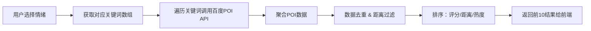

# 随心游小程序文档

1. [需求文档](#随心游小程序需求文档)

2. [接口文档](#随心游接口文档)
   
3. [推荐系统文档](#推荐系统文档) 

# 随心游小程序需求文档
## 1 引言

### 1.1 编写目的

&emsp;&emsp;本文档的目的是详细地介绍随心游小程序其Alpha版本所包含的需求，以便客户能够确认产品的确切需求以及开发人员能够根据需求设计编码。

### 1.2 背景
&emsp;&emsp;该项目为旅游工具性质的小程序，接口文档正在github创建，前端正在开发中。

## 2 任务概述

### 2.1 项目概述

#### 2.1.1 项目来源及背景
&emsp;&emsp;随心游微信小程序是一个可根据用户性格、心情、出发地、目的地等因素推荐短途旅行地点，规划旅行行程的旅行工具。用户可使用小程序在汕头规划自己的短途旅行的路线

#### 2.1.2 项目目标
&emsp;&emsp;我们希望该小程序功能尽量精简实用，页面简洁，用户能简单通过页面文字使用所需的功能，高效准确地为用户定制服务。


### 2.1.3 系统功能概述
1. 关于用户

(1)注册与登录：小程序自动通过微信openID进行注册与登录。

(2)设置信息：用户可以查看或修改头像、个性签名、性别、电话号码、性格等基础信息。

(3)查看信息：用户可以查看如基本信息、文章总量以及列表、点赞、旅行路径收藏。

(4)搜索用户：用户可以搜索其它用户。

(5)用户留言：创建、查看、删除留言。

(6)历史足迹： 用户可以查看走过的规划旅程。


2.关于社区

(1)文章：用户可以对文章进行增删查改、点赞、收藏、查看游览数量并搜索。


## 3 页面设计


### 3.1 全局
**导航栏** ：底部导航栏包含 **首页** **定制** **我的** 页面跳转

**搜索框** ：**首页**和**定制**页面有顶部搜索框，不可被隐藏

### 3.2 首页

**搜索框** ：首页顶部有顶部搜索框，

&emsp;&emsp;可搜索文章信息。搜索文章后可跳转到结果**文章列表**

&emsp;&emsp;可用户名或者用户ID。搜索文章后可跳转到结果**文章列表**

**公告栏** ：搜索框下有滚动播放栏，点击播放窗口图片可跳转推荐文章或者发布的公告。
                可用来推荐文章

**文章推荐列表**：**公告栏**下有文章推荐，点击后可跳转到具体文章内容。
向下滑寻找文章可以隐藏**滚动播放栏**

**文章列表**：**搜索框**搜索结果列表

**文章页面**： 文章页面包括文章内容和作者信息，图片，以及**收藏**、**点赞**、**留言**功能，点击作者信息**头像**可跳转到作者页面，可查看作者发表过的文章

### 3.3 定制

**地图窗口**： 用户定位（申请用户位置信息的权限），规划路径

**搜索框**： 底部有搜索栏，可搜索目的地，以及设置起始点（默认起始点为用户位置）、心情、路程、交通工具等信息要素

&emsp;&emsp;或者选择以**起始点**推荐目的地

&emsp;&emsp;无论是**搜索目的地**还是选择以**起始点**推荐目的地，都进行路径规划，在地图上显示路径规划的界面。生成的路径可导出为图片进行分享

**目的地推荐**： 搜索框搜索目的地后，用图标显示目的地

**导航**： 用户确定目的地和路径之后，为用户进行导航

### 3.4 我的

**个性化**：展示用户头像、账号、昵称（如无特殊设置一律为微信名）、格言

**个人信息**： 展示用户手机号、用户头像、账号、昵称（如无特殊设置一律为微信名）、格言，**可修改用户信息**

**文章发表**：可创建、修改、删除、查看文章

**历史足迹**：展示用户历史足迹

**收藏**： 包括用户的路径收藏和文章收藏

**系统公告**

## 4 功能需求

### 4.1 功能描述

**1.用户相关**

(1)用户注册

功能描述：小程序通过微信服务器提供的API获取用户openID，通过openID为用户注册

&emsp;&emsp;使用接口：

(2)用户登录
功能描述：用户登录小程序，为前端页面返回tokenID凭证，提供使用用户注销、创建、修改文章的权限

&emsp;&emsp;使用接口：

(3)修改用户信息
功能描述：

&emsp;&emsp;使用接口：

(4)查看用户信息
功能描述：显示当前用户性别、手机号、IP地址等信息

&emsp;&emsp;使用接口：

（5）用户收藏
功能描述：用户可收藏文章或者足迹

&emsp;&emsp;使用接口：

（6）查看收藏
功能描述：用户可查看收藏的文章或者足迹

&emsp;&emsp;使用接口：

（7）查看历史足迹
功能描述：用户可以查看走过的规划旅程。

（8）公告
功能描述：管理员账户可发布、查看、更新、删除公告公告，公告可能需要拥有一定的引导、跳转能力。


**2.社区相关**

(1)文章

功能描述：用户可以发布文章、查看文章、点赞收藏文章、文章标签、文章分类等。

&emsp;&emsp;使用接口：

（2）文章评论

&emsp;&emsp;使用接口：

（3）文章转发
功能描述：用户可以转发文章

&emsp;&emsp;使用接口：

**3.路径规划相关**

（1）定位

功能描述：定位用户当前位置

（2）目的地推荐

功能描述：输入用户起点和终点、旅程范围和时间等数据为用户推荐一个或多个目的地和途径地点，并且为用户规划最佳路径

（3）路径图片生成

功能描述：用户可将系统生成的路径生成图片

（3）路径分享

功能描述：用户可以分享历史足迹

# 5 其他需求

### 5.1 验收标准

交付周期为**两周一交付**，交付后由测试人员依据用户故事进行功能测试，并提出改进方案以及可能存在的bug。Alpha版本不包括exam系统、competition系统以及file系统。**迭代次数不得超过6次**。

### 5.2 资源建设

在交付周期进行时，我们需要制作出至少一份面向大众的页面引导以及各类资源。

### 5.3 对外联通

我们会尝试链接大众点评、美团、交通出行等功能

### 5.4 推荐系统

推荐系统要求实现输入一组用户的文章历史浏览信息、用户地址，推荐相关的文章；输入出发地、目的地、性格、心情等一组数据，推荐相关地点和规划最优路径

********************************************************


## 随心游接口文档

## 1.全局配置
**1.1 域名**: https://api.leonandor.com:8081/travel

**1.2 默认请求格式**: application/json（JSON 格式）

&emsp;&emsp; 说明: 大部分接口使用 JSON 格式进行数据传输，除非单独说明其他格式。

**1.3 返回格式**: application/json（JSON 格式）

**1.4 特殊表单提交格式**: application/x-www-form-urlencoded（URL编码格式）

&emsp;&emsp;说明: 部分接口可能使用 URL 编码格式进行数据传输，具体接口会在文档中单独标明。

**1.5 认证**:

&emsp;&emsp;登录接口无需认证。

&emsp;&emsp;/travel/post/* 接口需要使用 Authorization 头部传递 Token。

## 2.公共中间件

**CORS 中间件**: 允许跨域请求。

**Recovery 中间件**: 捕获并处理运行时错误，防止崩溃。


## 3. 接口详情

### 一、用户接口

**3.1.1 登录：**

接口地址: /login

请求方式：POST

**请求格式**：application/x-www-form-urlencoded

是否需要认证: 否

参数说明：

| 参数名      | 类型   | 必填 | 描述        |
|----------|--------|----|-----------|
| code     | string | 是  | 微信临时身份凭证，微信授权码 |

请求示例:

1. HTTP 请求头：
```http
    Content-Type: application/x-www-form-urlencoded
```

2. 请求体示例：
```http
  code=1234567890abcdef
```

3. 响应示例:
```json
{
  "code": 200,
  "token": "your_token_value",
  "SessionKey": "your_session_key_value",
  "msg": "登录成功"
}
```

4.  服务端处理示例（Gin框架）

```
func Login(ctx *gin.Context) {
	// 获取微信授权码
	code := ctx.PostForm("code")

	if code == "" {
		ctx.JSON(400, gin.H{
            "code": 400, 
            "msg": "参数错误"
        })
		return
	}

	// 模拟验证和处理逻辑
	ctx.JSON(200, gin.H{
		"code": 200,
		"token": "your_token_value",
		"SessionKey": "your_session_key_value",
		"msg": "登录成功"
	})
}
```

5. 返回示例

成功响应：
```json 
{
  "code": 200,
  "token": "your_token_value",
  "SessionKey": "your_session_key_value",
  "msg": "登录成功"
}
```

失败响应：
```json
{
  "code": 400, 
  "msg": "参数错误"
}

```

**3.1.2 微信授权询问接口：**(未写)
    http://api.leonandor.com:8081/travel/authorization

**3.1.3 获取用户信息**

接口地址: /user/info

接口描述： 向后端获取用户信息

请求方式：GET

是否需要认证: 是

参数说明：无

请求示例：
1. HTTP 请求头：
```http
    fetch('https://leonandor.com/GetUserInfo', {
                method: 'GET',
                headers: {
                    'Authorization': 'Bearer YOUR_TOKEN_HERE'
                }
            })
```
2. 返回示例：
```json
  {
  "code": 200, 
  "information": "这里是用户信息", 
  "msg": "获取用户信息成功"
}
```
**3.1.4 通过微信获取用户敏感信息（暂时没用，不建议用）：**

接口地址: /GetUserProfile

接口描述： 向微信获取用户敏感信息的密文

请求方式：POST

是否需要认证: 是

参数说明：

| 参数名            | 类型   | 必填 | 描述        |
|----------------|--------|----|-----------|
| encrypted_data | string | 是  |加密的用户数据，通常由小程序端提供  |
| iv             | string | 是  |加密算法的初始向量，通常由小程序端提供  |
| session_id     | string | 是  |会话标识符，用于校验用户登录状态与身份信息|

请求示例：
1. HTTP 请求头：
```http
    Content-Type: application/json
    Authorization: Bearer <token>
```

2. 请求体示例：
```json
{
    "encrypted_data": "CiyLU1Aw2KjvrjMdj8K...",
    "iv": "r7BXXKkLb8qrSNn05n0qiA==",
    "session_id": "abc123xyz456"
}
```
3. 返回示例:

成功响应：
```json
{
  "code": 200, 
  "plainText": "plainText  注意：这里是一段解析明文", 
  "msg": "操作成功"
}

```

失败响应：
```json
{
  "code": 500, 
  "msg": "服务器错误"
}
```
**3.1.5 更新用户信息**

接口地址: /user/update

接口描述： 向后端更新用户信息

请求方式：PATCH

是否需要认证: 是

参数说明：

| 参数名       | 类型   | 必填 | 描述     |
|-----------|--------|----|--------|
| telephone | string | 否  | 用户电话号码 |
| nick_name | string | 否  | 用户名    |
| motto     | string | 否  | 个人签名   |
| gender    | string | 否  | 性别     |
注：所有项为非必填项，但是不能一个不填

**3.1.6 更新用户信息**

接口地址: /user/postCreate

接口描述： 向后端获取用户创建的文章

请求方式：GET 

是否需要认证: 是

参数说明：无

### 二、文章接口

**3.2.1 创建文章：**
    http://api.leonandor.com:8081/travel/post/create

接口地址: /post/create

请求方式：POST

是否需要认证: 是

参数说明：

| 参数名      | 类型   | 必填 | 描述        |
|----------|--------|----|-----------|
| title    | string | 是  | 要创建的文章的题目 |
| head_img | string | 是  | 文章的图片     |
| content  | string | 是  | 文章内容      |

请求示例：
1. HTTP 请求头：
```http
    Content-Type: application/json
    Authorization: Bearer <token>
```

2. 请求体示例：
```json
{
    "title": "文章题目",
    "head_img": "https://stuecc.stu.edu.cn/images/20230228184558.png",
    "content": "这是文章内容"
}
```
3. 返回示例:

成功响应：
```json
{
  "code": 200, 
  "msg": "文章创建成功"
}

```

**3.2.2 更新文章：**
    http://api.leonandor.com:8081/travel/post/update/:id

接口地址: /update/:id

请求方式：PATCH

是否需要认证: 是

参数说明：

| 参数名      | 类型     | 必填 | 描述                       |
|----------|--------|----|--------------------------|
| id       | int    | 是  | 文章的唯一标识符（路径参数，无需放到请求体里面） |
| title    | string | 是  | 要创建的文章的题目                |
| head_img | string | 是  | 文章的图片                    |
| content  | string | 是  | 文章内容                     |

请求示例
 1. html（仅为示例）
```html 
fetch(`https://leonandor.com/travel/post/update/123456789`, {
                method: 'PATCH',
                headers: {
                    'Content-Type': 'application/json',
                    'Authorization': 'Bearer YOUR_TOKEN_HERE'
                },
                body: JSON.stringify({
                    title: title,
                    head_img: headImg,
                    content: content
                })
            })
```

**3.2.3 展示文章详情：**
    http://api.leonandor.com:8081/travel/post/show/:id

接口地址: /post/show/:id

请求方式：GET

是否需要认证: 是

**3.2.4 删除文章：**
    http://api.leonandor.com:8081/travel/post/delete/:id

接口地址: /post/delete/:id

请求方式：DELETE

是否需要认证: 是

**3.2.5 文章列表：**
    http://api.leonandor.com:8081/travel/post/page/list

接口地址: /post/page/list

请求方式：GET

是否需要认证: 是

### 三、用户收藏
**3.3.1 添加用户收藏：**
http://api.leonandor.com:8081/user/start/add/:id

接口地址: /user/start/add/:id

请求方式：POST

是否需要认证: 是

参数：无

**3.3.2 删除用户收藏：**
http://api.leonandor.com:8081/user/start/remove/:id

接口地址: /user/start/remove/:id

请求方式：DELETE

是否需要认证: 是

参数：无

**3.3.2 用户收藏列表：**
http://api.leonandor.com:8081/user/start/list

接口地址: /user/start/list

请求方式：GET

是否需要认证: 是

参数：无

### 三、搜索接口

**文章搜索：** http://api.leonandor.com:8081/travel/post/search

接口地址: /post/search

请求方式：GET

是否需要认证: 是

**用户搜索：**（未写）

### 四、用户对话接口

**用户私聊对话：**
    http://api.leonandor.com:8081/travel/user/chat

### 五、推荐接口

**用户文章推荐：**
    http://api.leonandor.com:8081/travel/post/recommand
********************************************************

## 推荐系统文档
本推荐系统用于“随心游”小程序中，基于用户当前选择的情绪，调用百度地图API实现个性化的短途旅行推荐，目标是快速、准确、贴合用户当前心理状态地推荐本地旅行目的地。

---

## 一、系统总体流程



---

## 二、推荐逻辑详细步骤

### 1. 接收前端传来的情绪值

用户在前端页面选择如“治愈感”“探索感”等情绪，前端将对应的字符串值通过GET或POST请求传至后端：

```json
{
  "mood": "治愈感"
}
```

---

### 2. 映射情绪 → 搜索关键词数组

后端维护关键词映射表：

```go
var moodKeywordMap = map[string][]string{
  "治愈感": {"公园", "海边", "图书馆", "绿地", "安静"},
  "浪漫感": {"夜景", "情侣座", "灯光", "海风", "花园"},
  // ... 其余略
}
```

---

### 3. 遍历关键词 → 调用百度POI API

依次调用百度地图 Place API：

```http
GET https://api.map.baidu.com/place/v2/search?query=关键词&region=汕头&output=json&ak=你的密钥
```

---

### 4. 聚合 POI 数据 & 去重 + 距离过滤

#### ✅ 去重（按名称+地址）
```go
seen := map[string]bool{}
if !seen[poi.Name+poi.Address] {
  seen[...] = true
}
```

#### ✅ 距离过滤

```go
func isWithinDistance(userLat, userLng, poiLat, poiLng float64, maxDistKm float64) bool {
    dist := CalculateDistance(userLat, userLng, poiLat, poiLng)
    return dist <= maxDistKm
}
```

使用 Haversine 算法计算两点之间距离。

---

### 5. 排序逻辑（评分 / 距离 / 热度）

| 排序项     | 实现方式                                       |
|------------|------------------------------------------------|
| 百度评分   | 百度 detail 接口支持评分信息（需额外请求）     |
| 距离       | 优先推荐距离用户更近的POI                     |
| 热度       | 关键词匹配：名称中包含“热门”“打卡”优先       |
| 手动权重   | 自定义POI推荐优先级，如“中山公园”手动+2权重  |

排序方式建议使用综合评分排序：

```go
sort.Slice(pois, func(i, j int) bool {
    return pois[i].Score > pois[j].Score
})
```

---

### 6. 返回前端格式

推荐前10个目的地，返回JSON格式：

```json
[
  {
    "name": "中山公园",
    "lat": 23.37,
    "lng": 116.71,
    "address": "汕头市龙湖区中山路",
    "distance": 2.4,
    "summary": "绿树成荫，安静宜人"
  }
]
```

---

## 三、注意事项

- 百度API调用频率有限，建议做缓存或冷启动数据预备
- 若关键词无结果，自动fallback到其他关键词
- 推荐结构需支持后续“用户偏好记录 + 行为学习”能力扩展

---

## 四、后续可扩展方向

- 多维度推荐权重融合（如历史点击 + 情绪）
- 用户画像标签生成
- POI分时段推荐（适合早/晚/节假日等）
- 数据落库，便于离线分析与复用

---
