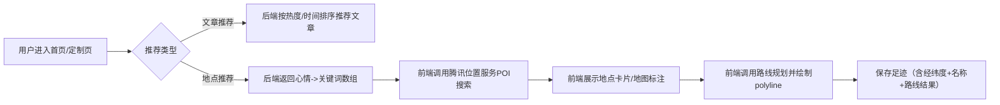
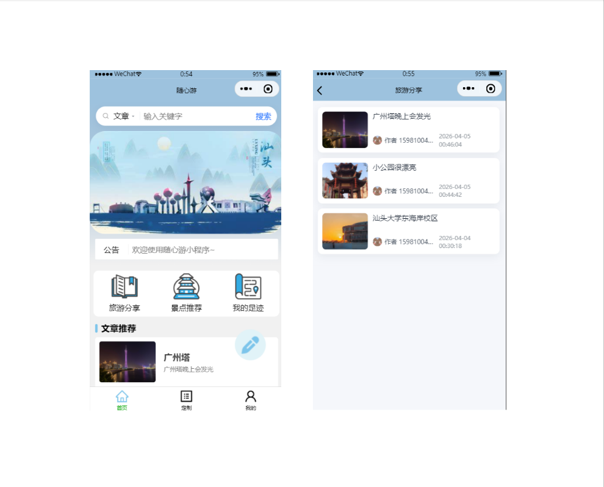
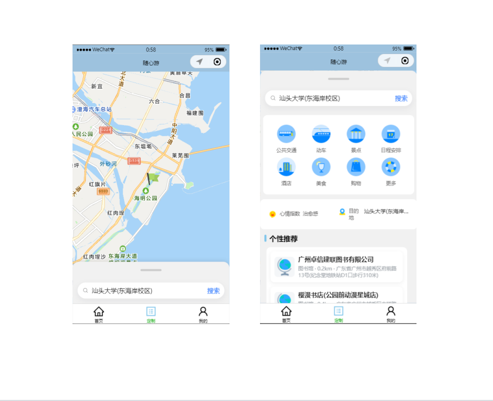
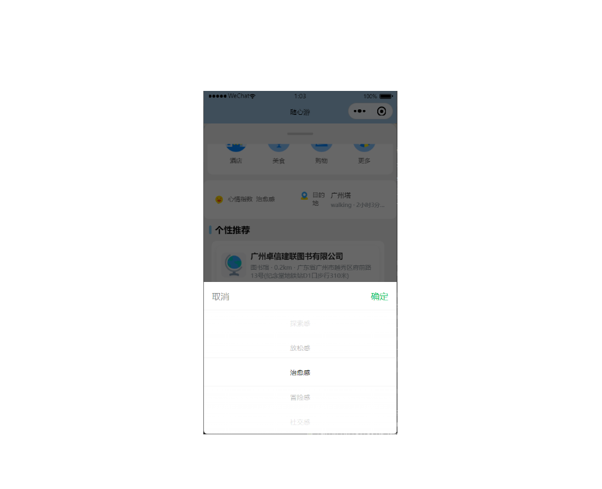
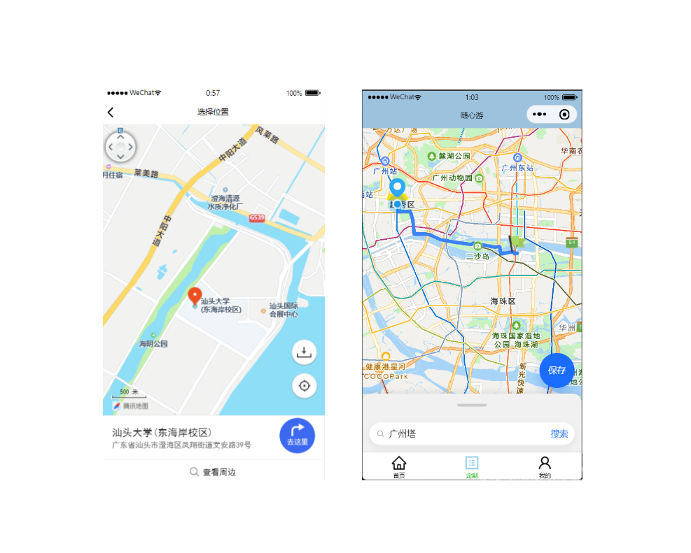
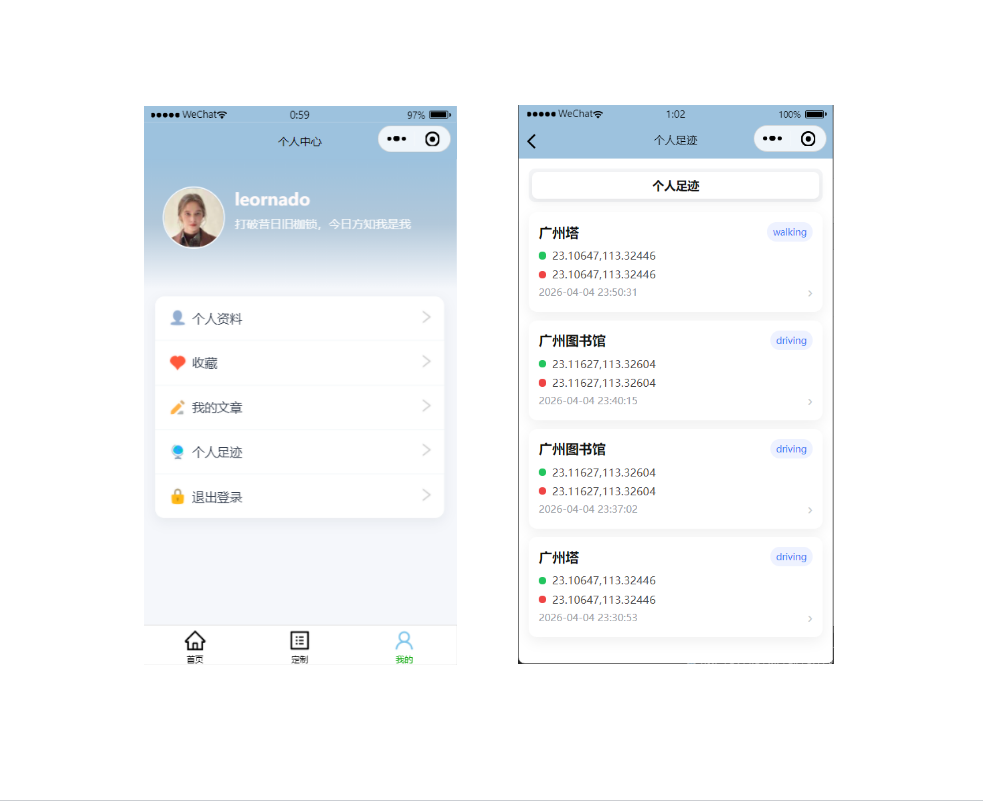
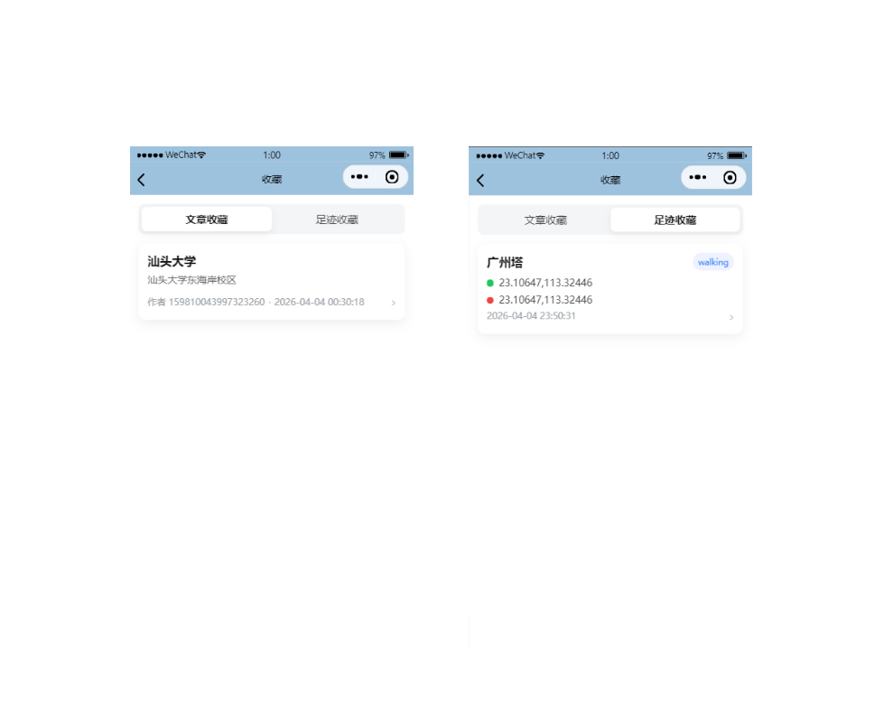

# 随心游小程序文档

1. [需求文档](#随心游小程序需求文档)

2. [接口文档](#随心游接口文档)
   
3. [推荐系统文档](#推荐系统文档) 

4. [小程序成型](#小程序成型) 

# 随心游小程序需求文档

## 1 引言

### 1.1 编写目的

&emsp;&emsp;本文档的目的是详细地介绍随心游小程序其Alpha版本所包含的需求，以便客户能够确认产品的确切需求以及开发人员能够根据需求设计编码。

### 1.2 背景
&emsp;&emsp;该项目为旅游工具性质的小程序，接口文档正在github创建，前端正在开发中。

## 2 任务概述

### 2.1 项目概述

#### 2.1.1 项目来源及背景
&emsp;&emsp;随心游微信小程序是一个可根据用户性格、心情、出发地、目的地等因素推荐短途旅行地点，规划旅行行程的旅行工具。用户可使用小程序在汕头规划自己的短途旅行的路线

#### 2.1.2 项目目标
&emsp;&emsp;我们希望该小程序功能尽量精简实用，页面简洁，用户能简单通过页面文字使用所需的功能，高效准确地为用户定制服务。


### 2.1.3 系统功能概述
1. 关于用户

(1)注册与登录：小程序自动通过微信openID进行注册与登录。

(2)设置信息：用户可以查看或修改头像、个性签名、性别、电话号码、性格等基础信息。

(3)查看信息：用户可以查看如基本信息、文章总量以及列表、点赞。

(4)搜索用户：用户可以搜索其它用户。

(5)用户留言：创建、查看、删除留言。

(6)历史足迹： 用户可以查看走过的规划旅程。

（7）收藏功能： 旅行路径收藏和查看旅行路径收藏


2.关于社区

(1)文章：用户可以对文章进行增删查改、点赞、收藏、查看游览数量并搜索。

（2）

3.关于搜索

（1）文章搜索与分类


## 3 页面设计


### 3.1 全局
**导航栏** ：底部导航栏包含 **首页** **定制** **我的** 页面跳转

**搜索框** ：**首页**和**定制**页面有顶部搜索框，不可被隐藏

### 3.2 首页

**搜索框** ：首页顶部有顶部搜索框，

&emsp;&emsp;可搜索文章信息。搜索文章后可跳转到结果**文章列表**

&emsp;&emsp;可用户名或者用户ID。搜索文章后可跳转到结果**文章列表**

**公告栏** ：搜索框下有滚动播放栏，点击播放窗口图片可跳转推荐文章或者发布的公告。
                可用来推荐文章

**文章推荐列表**：**公告栏**下有文章推荐，点击后可跳转到具体文章内容。
向下滑寻找文章可以隐藏**滚动播放栏**

**文章列表**：**搜索框**搜索结果列表

**文章页面**： 文章页面包括文章内容和作者信息，图片，以及**收藏**、**点赞**、**留言**功能，点击作者信息**头像**可跳转到作者页面，可查看作者发表过的文章

### 3.3 定制

**地图窗口**： 用户定位（申请用户位置信息的权限），规划路径

**搜索框**： 底部有搜索栏，可搜索目的地，以及设置起始点（默认起始点为用户位置）、心情、路程、交通工具等信息要素

&emsp;&emsp;或者选择以**起始点**推荐目的地

&emsp;&emsp;无论是**搜索目的地**还是选择以**起始点**推荐目的地，都进行路径规划，在地图上显示路径规划的界面。生成的路径可导出为图片进行分享

**目的地推荐**： 搜索框搜索目的地后，用图标显示目的地

**导航**： 用户确定目的地和路径之后，为用户进行导航

### 3.4 我的

**个性化**：展示用户头像、账号、昵称（如无特殊设置一律为微信名）、格言

**个人信息**： 展示用户手机号、用户头像、账号、昵称（如无特殊设置一律为微信名）、格言，**可修改用户信息**

**文章发表**：可创建、修改、删除、查看文章

**历史足迹**：展示用户历史足迹

**收藏**： 包括用户的路径收藏和文章收藏

**系统公告**

## 3 功能需求

### 3.1 功能描述

**1.用户相关**

(1)用户注册

功能描述：小程序通过微信服务器提供的API获取用户openID，通过openID为用户注册

&emsp;&emsp;使用接口：

(2)用户登录
功能描述：用户登录小程序，为前端页面返回tokenID凭证，提供使用用户注销、创建、修改文章的权限

&emsp;&emsp;使用接口：

(3)修改用户信息
功能描述：

&emsp;&emsp;使用接口：

(4)查看用户信息
功能描述：显示当前用户性别、手机号、IP地址等信息

&emsp;&emsp;使用接口：

（5）用户收藏
功能描述：用户可收藏文章或者足迹

&emsp;&emsp;使用接口：

（6）查看收藏
功能描述：用户可查看收藏的文章或者足迹

&emsp;&emsp;使用接口：

（7）查看历史足迹
功能描述：用户可以查看走过的规划旅程。

（8）公告
功能描述：管理员账户可发布、查看、更新、删除公告公告，公告可能需要拥有一定的引导、跳转能力。


**2.社区相关**

(1)文章

功能描述：用户可以发布文章、查看文章、点赞收藏文章、文章标签、文章分类等。

&emsp;&emsp;使用接口：

（2）文章评论

&emsp;&emsp;使用接口：

（3）文章转发
功能描述：用户可以转发文章

&emsp;&emsp;使用接口：

**3.路径规划相关**

（1）定位

功能描述：定位用户当前位置

（2）目的地推荐

功能描述：输入用户起点和终点、旅程范围和时间等数据为用户推荐一个或多个目的地和途径地点，并且为用户规划最佳路径

（3）路径图片生成

功能描述：用户可将系统生成的路径生成图片

（3）路径分享

功能描述：用户可以分享历史足迹

# 4 其他需求

### 4.1 验收标准

交付周期为**两周一交付**，交付后由测试人员依据用户故事进行功能测试，并提出改进方案以及可能存在的bug。Alpha版本不包括exam系统、competition系统以及file系统。**迭代次数不得超过6次**。

### 4.2 资源建设

在交付周期进行时，我们需要制作出至少一份面向大众的页面引导以及各类资源。

### 4.3 对外联通

我们会尝试链接大众点评、美团、交通出行等功能

### 4.4 推荐系统

推荐系统要求实现输入一组用户的文章历史浏览信息、用户地址，推荐相关的文章；输入出发地、目的地、性格、心情等一组数据，推荐相关地点和规划最优路径

# 5 实现补充（新增功能）

本章节用于记录“需求文档未明确提到但已实现”的功能点，便于结项验收与答辩展示。原有需求不做修改。

### 5.1 文章与社区新增能力

（1）文章推荐兜底

功能描述：首页文章推荐默认取最多 5 篇推荐文章；当推荐结果为空时自动兜底展示最新文章（有多少展示多少）。

（2）文章删除级联清理

功能描述：删除文章时同步删除该文章下的评论、点赞记录、收藏记录，避免数据残留。

（3）按用户查看文章列表

功能描述：支持进入某位作者后查看其发布过的文章列表（分页）。

### 5.2 地图与足迹新增能力

（1）地点搜索

功能描述：定制页顶部支持搜索地点，展示搜索结果并在地图中标注目的地。

（2）三模式路线规划与展示

功能描述：支持驾车/公交/步行三种模式路线规划，地图绘制 polyline，并展示预计时间与距离。

（3）浮动保存按钮

功能描述：地图右下角提供“保存”浮动按钮，随底部面板上滑覆盖地图而隐藏；保存时根据当前规划模式（驾车/公交/步行）写入足迹。

（4）足迹展示名称

功能描述：足迹保存时除经纬度外同步保存起点/终点名称，个人足迹列表展示名称而非经纬度。

（5）删除足迹

功能描述：个人足迹列表支持删除自己创建的足迹，并同步清理该足迹的收藏记录。

### 5.3 页面与交互新增优化

（1）搜索框统一样式

功能描述：首页与定制页搜索框统一为“高德简洁风”样式（右侧蓝色搜索、圆角白底、轻阴影）。

（2）景点推荐入口

功能描述：首页“景点推荐”入口可触发“附近景点推荐”，并给出推荐原因（距离/地址等）。

********************************************************


# 随心游接口文档

## 1.全局配置
**1.1 域名**: https://api.leonandor.com:8081/travel

**本地开发域名（可选）**: http://127.0.0.1:1016/travel

**1.2 默认请求格式**: application/json（JSON 格式）

&emsp;&emsp; 说明: 大部分接口使用 JSON 格式进行数据传输，除非单独说明其他格式。

**1.3 返回格式**: application/json（JSON 格式）

**1.4 特殊表单提交格式**: application/x-www-form-urlencoded（URL编码格式）

&emsp;&emsp;说明: 部分接口可能使用 URL 编码格式进行数据传输，具体接口会在文档中单独标明。

**1.5 认证**:

&emsp;&emsp;登录接口无需认证。

&emsp;&emsp;/travel 下除公告列表/公告详情等少数接口外，均需要使用 Authorization 头部传递 Token。

请求头示例：
```http
Authorization: Bearer <token>
```

## 2.公共中间件

**CORS 中间件**: 允许跨域请求。

**Recovery 中间件**: 捕获并处理运行时错误，防止崩溃。


## 3. 接口详情

### 一、用户接口

**3.1.1 登录：**

接口地址: /login

请求方式：POST

**请求格式**：application/x-www-form-urlencoded

是否需要认证: 否

参数说明：

| 参数名      | 类型   | 必填 | 描述        |
|----------|--------|----|-----------|
| code     | string | 是  | 微信临时身份凭证，微信授权码 |

请求示例:

1. HTTP 请求头：
```http
    Content-Type: application/x-www-form-urlencoded
```

2. 请求体示例：
```http
  code=1234567890abcdef
```

3. 响应示例:
```json
{
  "code": 200,
  "token": "your_token_value",
  "SessionKey": "your_session_key_value",
  "msg": "登录成功"
}
```

4.  服务端处理示例（Gin框架）

```
func Login(ctx *gin.Context) {
  // 获取微信授权码
  code := ctx.PostForm("code")

  if code == "" {
    ctx.JSON(400, gin.H{
            "code": 400, 
            "msg": "参数错误"
        })
    return
  }

  // 模拟验证和处理逻辑
  ctx.JSON(200, gin.H{
    "code": 200,
    "token": "your_token_value",
    "SessionKey": "your_session_key_value",
    "msg": "登录成功"
  })
}
```

5. 返回示例

成功响应：
```json 
{
  "code": 200,
  "token": "your_token_value",
  "SessionKey": "your_session_key_value",
  "msg": "登录成功"
}
```

失败响应：
```json
{
  "code": 400, 
  "msg": "参数错误"
}

```

**3.1.2 微信授权询问接口：**(未写)
    http://api.leonandor.com:8081/travel/authorization

**3.1.3 获取用户信息**

接口地址: /user/info

接口描述： 向后端获取用户信息

请求方式：GET

是否需要认证: 是

参数说明：无

请求示例：
1. HTTP 请求头：
```http
    fetch('https://leonandor.com/GetUserInfo', {
                method: 'GET',
                headers: {
                    'Authorization': 'Bearer YOUR_TOKEN_HERE'
                }
            })
```
2. 返回示例：
```json
  {
  "code": 200, 
  "information": "这里是用户信息", 
  "msg": "获取用户信息成功"
}
```
**3.1.4 通过微信获取用户敏感信息（暂时没用，不建议用）：**

接口地址: /GetUserProfile

接口描述： 向微信获取用户敏感信息的密文

请求方式：POST

是否需要认证: 是

参数说明：

| 参数名            | 类型   | 必填 | 描述        |
|----------------|--------|----|-----------|
| encrypted_data | string | 是  |加密的用户数据，通常由小程序端提供  |
| iv             | string | 是  |加密算法的初始向量，通常由小程序端提供  |
| session_id     | string | 是  |会话标识符，用于校验用户登录状态与身份信息|

请求示例：
1. HTTP 请求头：
```http
    Content-Type: application/json
    Authorization: Bearer <token>
```

2. 请求体示例：
```json
{
    "encrypted_data": "CiyLU1Aw2KjvrjMdj8K...",
    "iv": "r7BXXKkLb8qrSNn05n0qiA==",
    "session_id": "abc123xyz456"
}
```
3. 返回示例:

成功响应：
```json
{
  "code": 200, 
  "plainText": "plainText  注意：这里是一段解析明文", 
  "msg": "操作成功"
}

```

失败响应：
```json
{
  "code": 500, 
  "msg": "服务器错误"
}
```
**3.1.5 更新用户信息**

接口地址: /user/update

接口描述： 向后端更新用户信息

请求方式：PATCH

是否需要认证: 是

参数说明：

| 参数名       | 类型   | 必填 | 描述     |
|-----------|--------|----|--------|
| telephone | string | 否  | 用户电话号码 |
| nick_name | string | 否  | 用户名    |
| motto     | string | 否  | 个人签名   |
| gender    | string | 否  | 性别     |
注：所有项为非必填项，但是不能一个不填

**3.1.6 更新用户信息**

接口地址: /user/postCreate

接口描述： 向后端获取用户创建的文章

请求方式：GET 

是否需要认证: 是

参数说明：无

**3.1.7 搜索用户：**

接口地址: /user/search

请求方式：GET

是否需要认证: 是

参数说明：

| 参数名   | 类型     | 必填 | 描述        |
|---------|----------|------|------------|
| keyword | string   | 是   | 用户关键词（昵称/手机号） |
| limit   | int      | 否   | 返回条数（默认20，最大50）|

### 二、文章接口

**3.2.1 创建文章：**
    http://api.leonandor.com:8081/travel/post/create

接口地址: /post/create

请求方式：POST

是否需要认证: 是

参数说明：

| 参数名      | 类型   | 必填 | 描述        |
|----------|--------|----|-----------|
| title    | string | 是  | 要创建的文章的题目 |
| head_img | string | 是  | 文章的图片     |
| content  | string | 是  | 文章内容      |

请求示例：
1. HTTP 请求头：
```http
    Content-Type: application/json
    Authorization: Bearer <token>
```

2. 请求体示例：
```json
{
    "title": "文章题目",
    "head_img": "https://stuecc.stu.edu.cn/images/20230228184558.png",
    "content": "这是文章内容"
}
```
3. 返回示例:

成功响应：
```json
{
  "code": 200, 
  "msg": "文章创建成功"
}

```

**3.2.2 更新文章：**
    http://api.leonandor.com:8081/travel/post/update/:id

接口地址: /update/:id

请求方式：PATCH

是否需要认证: 是

参数说明：

| 参数名      | 类型     | 必填 | 描述                       |
|----------|--------|----|--------------------------|
| id       | int    | 是  | 文章的唯一标识符（路径参数，无需放到请求体里面） |
| title    | string | 是  | 要创建的文章的题目                |
| head_img | string | 是  | 文章的图片                    |
| content  | string | 是  | 文章内容                     |

请求示例
 1. html（仅为示例）
```html 
fetch(`https://leonandor.com/travel/post/update/123456789`, {
                method: 'PATCH',
                headers: {
                    'Content-Type': 'application/json',
                    'Authorization': 'Bearer YOUR_TOKEN_HERE'
                },
                body: JSON.stringify({
                    title: title,
                    head_img: headImg,
                    content: content
                })
            })
```

**3.2.3 展示文章详情：**
    http://api.leonandor.com:8081/travel/post/show/:id

接口地址: /post/show/:id

请求方式：GET

是否需要认证: 是

**3.2.4 删除文章：**
    http://api.leonandor.com:8081/travel/post/delete/:id

接口地址: /post/delete/:id

请求方式：DELETE

是否需要认证: 是

**3.2.5 文章列表：**
    http://api.leonandor.com:8081/travel/post/page/list

接口地址: /post/page/list

请求方式：GET

是否需要认证: 是

**3.2.6 按用户ID获取文章列表：**

接口地址: /post/user

请求方式：GET

是否需要认证: 是

参数说明：

| 参数名   | 类型   | 必填 | 描述      |
|---------|--------|------|----------|
| userID  | uint64 | 是   | 用户ID    |
| pageNum | int    | 否   | 页码（默认1） |
| pageSize| int    | 否   | 每页条数（默认20） |

返回示例：
```json
{
  "code": 200,
  "data": [],
  "total": 0,
  "msg": "获取成功"
}
```

**3.2.7 文章点赞 / 取消点赞：**

接口地址: /post/like/:id

请求方式：POST（点赞） / DELETE（取消点赞）

是否需要认证: 是

成功响应：
```json
{ "code": 200, "msg": "点赞成功" }
```

**3.2.8 文章评论：创建 / 列表 / 删除：**

创建评论：

接口地址: /post/:id/comment

请求方式：POST

是否需要认证: 是

请求体示例：
```json
{ "content": "评论内容" }
```

评论列表：

接口地址: /post/:id/comment/list

请求方式：GET

是否需要认证: 是

参数：pageNum/pageSize（可选）

删除评论：

接口地址: /post/comment/:id

请求方式：DELETE

是否需要认证: 是

**3.2.9 删除文章说明（级联清理）：**

接口地址: /post/delete/:id

请求方式：DELETE

是否需要认证: 是

说明：删除文章时，会同时删除该文章下的评论、点赞记录与收藏记录，避免数据残留。

### 三、用户收藏
**3.3.1 添加用户收藏：**
http://api.leonandor.com:8081/user/start/add/:id

接口地址: /user/start/add/:id

请求方式：POST

是否需要认证: 是

参数：无

**3.3.2 删除用户收藏：**
http://api.leonandor.com:8081/user/start/remove/:id

接口地址: /user/start/remove/:id

请求方式：DELETE

是否需要认证: 是

参数：无

**3.3.2 用户收藏列表：**
http://api.leonandor.com:8081/user/start/list

接口地址: /user/start/list

请求方式：GET

是否需要认证: 是

参数：无

### 三、搜索接口

**文章搜索：** http://api.leonandor.com:8081/travel/post/search

接口地址: /post/search

请求方式：GET

是否需要认证: 是

**用户搜索：**（未写）

### 四、足迹接口

**4.1 创建足迹：**

接口地址: /foot/create

请求方式：POST

是否需要认证: 是

请求体示例：
```json
{
  "title": "目的地名称",
  "origin": "23.12,113.26",
  "origin_name": "广州市人民政府",
  "destinations": ["23.10,113.30"],
  "destination_names": ["广州塔"],
  "mode": "driving",
  "routeResult": {}
}
```

说明：
- origin/destinations 保存经纬度字符串（后台存储用）
- origin_name/destination_names 保存可展示的地点名称（前端展示用）
- routeResult 为第三方路线规划原始返回（JSON）

**4.2 获取个人足迹列表：**

接口地址: /foot/list

请求方式：GET

是否需要认证: 是

参数：pageNum/pageSize（可选）

**4.3 获取足迹详情：**

接口地址: /foot/show/:id

请求方式：GET

是否需要认证: 是

**4.4 删除足迹：**

接口地址: /foot/delete/:id

请求方式：DELETE

是否需要认证: 是

说明：仅允许删除自己创建的足迹；删除时会同步清理该足迹的收藏记录。

### 五、足迹收藏接口

**5.1 收藏足迹：**

接口地址: /foot/start/add/:id

请求方式：POST

是否需要认证: 是

**5.2 取消收藏足迹：**

接口地址: /foot/start/remove/:id

请求方式：DELETE

是否需要认证: 是

**5.3 足迹收藏列表：**

接口地址: /foot/start/list

请求方式：GET

是否需要认证: 是

### 四、用户对话接口

**用户私聊对话：**
    http://api.leonandor.com:8081/travel/user/chat

### 五、推荐接口

**用户文章推荐：**
    http://api.leonandor.com:8081/travel/post/recommand

**心情推荐关键词：**

接口地址: /recommend

请求方式：GET

是否需要认证: 是

参数说明：

| 参数名 | 类型   | 必填 | 描述 |
|-------|--------|------|------|
| mood  | string | 是   | 心情（探索感/放松感/治愈感/冒险感/社交感/浪漫感/空白感/回忆感） |
| region| string | 否   | 推荐地域（默认读配置，兜底为汕头） |

返回示例：
```json
{
  "code": 200,
  "data": {
    "mood": "治愈感",
    "keywords": ["公园","海边","图书馆"],
    "region": "汕头"
  },
  "msg": "获取推荐关键词成功"
}
```

********************************************************

# 推荐系统文档

本文档描述“随心游”小程序的推荐系统设计与实现，包含：
- 文章推荐：为用户推荐合适的社区文章
- 地点推荐：基于用户“心情指数”推荐附近地点，并支持路线规划与保存足迹

## 一、系统总体流程


```mermaid
graph LR
  A[用户进入首页/定制页] --> B{推荐类型}
  B -->|文章推荐| C[后端按热度/时间排序推荐文章]
  B -->|地点推荐| D[后端返回心情->关键词数组]
  D --> E[前端调用腾讯位置服务POI搜索]
  E --> F[前端展示地点卡片/地图标注]
  F --> G[前端调用路线规划并绘制polyline]
  G --> H[保存足迹（含经纬度+名称+路线结果）]
```

## 二、文章推荐设计

### 2.1 推荐目标

- 首页“文章推荐”最多展示 5 篇
- 推荐内容必须是数据库中真实存在的文章
- 若推荐规则取不到足够文章，则按“最新文章”兜底（有多少展示多少）

### 2.2 推荐接口

- `GET /travel/post/recommand?limit=5`

### 2.3 推荐策略

- 过滤：排除当前用户自己发布的文章
- 排序：按 `like_count desc, view_count desc, created_at desc`
- 截断：取前 `limit` 条
- 兜底：若结果为空（或推荐失败），返回“最新文章”按 `created_at desc` 取前 `limit`

该策略兼顾热度与时效，且实现成本低、可解释性强，适合毕业设计场景。

## 三、地点推荐（心情指数）设计

### 3.1 推荐目标

- 用户选择心情后，快速得到“可去的附近地点”
- 推荐具有可解释性：展示推荐原因（关键词/距离/地址）
- 支持三种路线模式：驾车/公交/步行
- 可一键保存路线为“足迹”，用于个人足迹与收藏展示

### 3.2 后端：心情 → 关键词映射

后端接口仅负责“心情→关键词数组”的映射，并返回推荐地域 region（可配置/可前端覆盖）。

- `GET /travel/recommend?mood=治愈感&region=全国`

返回：
```json
{
  "code": 200,
  "data": {
    "mood": "治愈感",
    "keywords": ["公园","海边","图书馆","绿地","湖边","安静"],
    "region": "汕头"
  },
  "msg": "获取推荐关键词成功"
}
```

### 3.3 前端：关键词 → POI 搜索与展示

前端在定制页使用腾讯位置服务 SDK（qqmap-wx-jssdk）：
- `search(keyword=关键词, location=当前定位, region=全国, distance=...)`
- 结果用于：
  - 地图 marker 标注
  - 推荐列表展示（名称/地址/推荐原因）

推荐原因示例（前端生成）：
- `附近景点 · 2.3km · 广州市天河区...`

### 3.4 路线规划与可视化

路线规划使用腾讯位置服务 `direction`：
- `mode=driving / transit / walking`
- 返回 `polyline` 后解码为坐标点数组，绘制在 map 组件的 `polyline` 上
- 同时计算并展示 “预计时间/距离”

显示格式：
- `walking · 2小时03分钟 · 8.1km`

## 四、配额与降级策略（重要）

腾讯位置服务 WebService API 对 key 存在调用限额，常见错误：
- `status=121`：此 key 每日调用量已达到上限

为降低不必要消耗，前端策略：
- 地点搜索仅在用户点击“搜索”时请求（不做输入联想的持续请求）
- 推荐列表/景点推荐按需触发（点击入口才触发）
- 当接口返回 121 时，在前端提示并引导更换 key/次日再试

## 五、可扩展方向

- 文章推荐：引入用户行为（浏览/收藏/点赞）做协同过滤或内容相似度推荐
- 地点推荐：结合用户历史足迹、收藏足迹、时间段（白天/夜晚）做权重调整
- 服务端缓存：对热门关键词 + 常见位置做短时缓存，降低外部 API 调用

---

# 小程序成型






