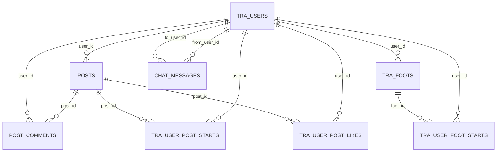

# 短途旅行信息服务系统的设计及实现

**摘  要:** 随着个性化旅游需求的日益增长，传统的旅游平台往往难以满足用户对于短途、即兴及情感化行程的需求。本文设计并实现了一款名为“随心游”的微信小程序，旨在为用户提供基于心理因素与地理位置的定制化旅游方案。系统采用前后端分离架构，前端基于微信小程序原生框架开发，后端利用高效的 API 接口进行数据交互。

本系统的核心亮点在于构建了一个多维度的推荐模型，整合了用户性格、实时心情、出发地及交通工具等因子，实现目的地的智能筛选与路径规划。此外，系统集成了高德/腾讯地图服务，支持行程轨迹的实时可视化与分享，并设有社区模块供用户发布游记与互动。测试结果表明，该系统运行稳定，界面简洁，能够有效降低用户的决策成本，提升短途旅行的规划效率与趣味性。

**关键词:** 微信小程序；旅游管理系统；个性化推荐；路径规划；社交社区


# Design and implementation of a short-distance travel information service system

**Abstract:** With the increasing demand for personalized travel, traditional platforms often fail to meet users' needs for short-term, spontaneous, and emotionally-driven itineraries. This paper designs and implements a WeChat Mini-program named "Ongoing Trip," which aims to provide users with customized travel solutions based on psychological factors and geographic location. The system adopts a decoupled front-end and back-end architecture, with the front-end developed on the WeChat native framework and the back-end utilizing efficient APIs for data interaction.

The core highlight of this system is the construction of a multi-dimensional recommendation model that integrates user personality, real-time mood, departure point, and transportation modes to achieve intelligent destination filtering and route planning. Furthermore, the system integrates map services to support real-time visualization and sharing of travel trajectories, along with a community module for travelogue publishing and interaction. Testing results indicate that the system is stable and user-friendly, effectively reducing decision-making costs and enhancing the efficiency and enjoyment of short-trip planning.

**Keywords**：WeChat Mini-program; Travel Management System; Personalized Recommendation; Route Planning; Social Community


### 目    录

1. 绪论	（1）

1.1 研究背景及意义	（1）

1.2 本文主要研究内容	（1）

1.3 论文结构安排	（2）

2. 相关技术及开发工具	（3）

2.1 微信小程序开发技术	（3）

2.2 后端服务开发技术	（3）

2.3 个性化推荐算法简介	（4）

2.4 地图API接入技术	（4）

3. 系统需求分析	（5）

3.1 可行性分析	（5）

3.1.1 技术可行性	（5）

3.1.2 经济可行性	（5）

3.1.3 操作可行性	（5）

3.2 功能需求分析	（6）

3.2.1 用户管理模块	（6）

3.2.2 社区交流模块	（6）

3.2.3 旅游定制模块	（7）

3.3 非功能需求分析	（7）

4. 系统总体设计	（8）

4.1 系统总体架构设计	（8）

4.2 系统功能模块设计	（8）

4.3 核心业务流程设计	（9）

4.3.1 目的地推荐流程设计	（9）

4.3.2 路径规划流程设计	（10）

4.4 数据库设计	（10）

4.4.1 概念模型设计（E-R图）	（10）

4.4.2 逻辑结构设计	（11）

5. 系统详细设计与实现	（12）

5.1 前端小程序界面实现	（12）

5.1.1 首页及推荐展示	（12）

5.1.2 行程定制与地图导航	（12）

5.1.3 社区交流与游记发布	（13）

5.1.4 个人中心功能实现	（13）

5.2 后端核心功能实现	（14）

5.2.1 用户鉴权与管理实现	（14）

5.2.2 多维度推荐算法实现	（14）

5.2.3 路径规划接口集成	（15）

6. 系统测试	（16）

6.1 测试环境与工具	（16）

6.2 功能测试	（16）

6.2.1 用户登录测试	（16）

6.2.2 旅游定制及路径规划测试	（17）

6.2.3 社区功能测试	（17）

6.3 测试结果分析	（18）

7. 总结与展望	（19）

7.1 总结	（19）

7.2 展望	（19）

参考文献 	（20）

致谢 	（21）

### 1. 绪论
**1.1 研究背景及意义**

在经济蓬勃发展和人们生活水平不断提升的今天，旅游已经成为众多人选择的休闲方式。特别是年轻人群，他们追求的不仅仅是一次简单的外出，而是希望通过“说走就走”的旅行来表达一种生活态度，一种对自由和探索的向往。然而，现实中的旅行规划往往繁琐复杂，让人在准备过程中感到迷茫和疲惫，这无疑增加了旅行的门槛。

此外，受限于时间和经济条件，许多用户更倾向于在居住或工作地点附近进行短途休闲，而非远距离的长途旅行。市场上现有的旅行工具大多聚焦于提供从一地到另一地的出行方案，包括交通方式选择、酒店饭店推荐等，但对于短途、随性的旅行需求，却鲜有工具能够提供具体而个性化的旅行规划方案。现有的旅行攻略推荐，如小红书等平台，虽然提供了丰富的旅行内容，但往往基于博主的个人经验，缺乏对用户个性化需求的考量和满足。

针对上述痛点，“随心游”小程序以用户为中心，从心情、性格、目的地偏好、个人习惯、旅行时间与预算等多维信息出发，生成贴合用户个性化需求的旅行攻略，并在地图上自动生成可视化路线，显著降低行前准备的复杂度。

项目在汕头开展试验，结合当地丰富的文化与自然资源，提供特色文旅、美食与文创产品的智能推荐，提升游客体验，促进地方文旅产业升级。

同时，项目呼应国家乡村振兴与文化旅游发展政策，通过智能化服务带动地方旅游消费与文化传承，具有明显的社会价值与应用推广意义。

综上，本课题的研究意义在于：一是探索“情绪+地理位置+出行约束”的个性化旅行定制模式；二是落地可用的微信小程序端到端实现；三是为短途旅行场景提供可复制的技术框架与实现范式。

**1.2 本文主要研究内容**

本文围绕“随心游”短途旅行信息服务系统的设计与实现展开研究，主要内容包括：

① 系统需求分析与可行性研究：明确用户管理、社区交流、旅游定制等核心功能及性能、可靠性等非功能需求；

② 总体架构设计：采用前后端分离架构，微信小程序作为前端，后端提供 REST 风格 API 服务，并集成第三方地图 SDK；

③ 前端实现：完成首页与推荐展示、地图定制与导航、社区发布与互动、个人中心信息管理等界面与交互逻辑；

④ 后端实现：基于用户 OpenID 的鉴权与权限控制，提供文章/收藏/历史足迹/公告等业务接口，以及推荐与路径规划相关服务的封装；

⑤ 多维度推荐模型构建：综合性格、心情、出发地、交通方式、时间与预算等因子，输出目的地与途径点集合，并与路径规划联动；

⑥ 路径规划与可视化分享：调用地图服务生成路线，支持轨迹可视化与图片导出分享；

⑦ 系统测试与评估：开展功能性与稳定性测试，对用户体验与性能表现进行分析评估。

**1.3 论文结构安排**

本论文结构安排如下：  

第1章 绪论：阐述研究背景与意义，给出研究内容与论文结构；  

第2章 相关技术及开发工具：介绍微信小程序框架、后端服务技术、推荐算法与地图 API 接入；

第3章 系统需求分析：从可行性、功能与非功能需求三个维度进行分析；  

第4章 系统总体设计：给出系统架构、模块设计、核心业务流程与数据库设计；  

第5章 系统详细设计与实现：分别说明前端与后端的实现细节，以及推荐与路径规划的集成； 

第6章 系统测试：描述测试环境与用例设计，分析测试结果；  

第7章 总结与展望：总结工作并提出后续优化方向。

### 2. 相关技术及开发工具

**2.1 微信小程序开发技术**  

本系统前端采用微信小程序原生框架实现，整体遵循“配置驱动 + 组件化视图 + 事件驱动逻辑”的开发范式。工程由全局入口与页面模块构成：全局入口包含应用级脚本与样式及配置文件，如 [app.js](file:///c:/Users/荟蔚青青/Desktop/毕设/miniprogram-5/miniprogram-5/app.js)、[app.json](file:///c:/Users/荟蔚青青/Desktop/毕设/miniprogram-5/miniprogram-5/app.json)、[app.wxss](file:///c:/Users/荟蔚青青/Desktop/毕设/miniprogram-5/miniprogram-5/app.wxss)；页面模块采用 WXML + WXSS + JS 的三件套结构，例如地图页面 [map](file:///c:/Users/荟蔚青青/Desktop/毕设/miniprogram-5/miniprogram-5/pages/map) 与首页 [home](file:///c:/Users/荟蔚青青/Desktop/毕设/miniprogram-5/miniprogram-5/pages/home)。

为提升首屏加载与模块划分的清晰度，项目采用分包机制，典型分包包括首页与用户中心等功能域，如 [packages/home/pages/articleDetail](file:///c:/Users/荟蔚青青/Desktop/毕设/miniprogram-5/miniprogram-5/packages/home/pages/articleDetail) 与 [packages/user/pages/personalData](file:///c:/Users/荟蔚青青/Desktop/毕设/miniprogram-5/miniprogram-5/packages/user/pages/personalData)。公共组件与工具函数统一沉淀在公共目录，示例见登录组件 [login](file:///c:/Users/荟蔚青青/Desktop/毕设/miniprogram-5/miniprogram-5/common/components/login.js) 与工具库 [util.js](file:///c:/Users/荟蔚青青/Desktop/毕设/miniprogram-5/miniprogram-5/common/utils/util.js)。

数据绑定通过 WXML 中的 Mustache 语法与 setData 进行状态更新，事件处理通过 onLoad/onShow/onReady 等页面生命周期以及 bindtap/bindinput 等事件实现。网络通信采用小程序内置的 wx.request 封装，统一约定 JSON 作为接口数据格式；鉴权流程使用 wx.login 获取临时 code，由后端交换 openId 并生成会话令牌，结合本地存储（wx.setStorage）维持登录态。

开发与调试依托微信开发者工具，项目使用 [project.config.json](file:///c:/Users/荟蔚青青/Desktop/毕设/miniprogram-5/miniprogram-5/project.config.json) 管理构建与预览配置，并采用 [.eslintrc.js](file:///c:/Users/荟蔚青青/Desktop/毕设/miniprogram-5/miniprogram-5/.eslintrc.js) 约束代码风格与潜在问题。站点地图文件 [sitemap.json](file:///c:/Users/荟蔚青青/Desktop/毕设/miniprogram-5/miniprogram-5/sitemap.json) 用于配合微信搜索收录。权限相关能力（如定位）通过 wx.authorize 与 wx.getLocation 获取，并与地图组件联动用于路径绘制与导航。

**2.2 后端服务开发技术**

后端以 REST 风格的接口为前端提供统一的数据服务，核心资源覆盖用户、文章、评论、收藏、历史足迹与系统公告等。接口统一使用 HTTPS 与 JSON 序列化，采用分层架构（路由 → 控制器 → 服务 → 数据访问）实现职责内聚与可维护性。

鉴权与安全方面，后端基于微信 openId 完成用户注册与登录，使用会话令牌（token）对接口进行访问控制，同时在输入校验、速率限制、敏感信息存储（如手机号）与操作审计方面进行安全加固。文件与图片等静态资源采用对象存储或服务器本地存储策略，并在返回内容中提供可访问的 URL。

数据存储方面，推荐使用关系型数据库设计用户、文章、标签、收藏、足迹与公告等表结构；对于文章检索与推荐所需的文本特征，可结合倒排索引或轻量全文检索方案提升查询效率。为满足高频查询（如首页推荐与热度榜单），可以引入缓存提升响应速度。运行监控通过应用日志、接口耗时统计与错误追踪实现问题定位。

**2.3 个性化推荐算法简介**

系统的推荐功能覆盖“文章推荐”与“目的地/途径点推荐”两类场景。整体采用“候选生成 + 特征表达 + 排序打分 + 反馈闭环”的混合推荐策略：  
① 候选生成：结合地理围栏（用户当前位置与可选出发点）、标签与主题、城市/区域热门 POI 与文章、用户历史行为（浏览、点赞、收藏、足迹）生成初始候选集；  
② 特征表达：从用户侧抽取性格、心情、兴趣标签、预算/时间约束等；从内容侧抽取地点/文章的主题标签、距离与通达性、开放时间、交互热度等；  
③ 排序打分：采用加权线性模型或树模型进行综合打分，地理约束（距离、交通时长）与时间/预算约束以硬约束或惩罚项方式纳入，保证可执行性；  
④ 冷启动与探索：新用户以主题问答与默认热门/地标结合的方式缓解冷启动；通过加入随机探索或多臂老虎机策略在热门与长尾之间平衡；  
⑤ 反馈闭环：根据点击率、收藏/点赞、停留时长、路线完成率等指标进行在线/离线评估与参数更新。

文章推荐偏重兴趣相关性与交互热度，地点推荐则强调地理邻近性、兴趣匹配度与交通可达性，并与路径规划服务联动，保证被推荐的目的地能够形成连贯的旅行路线。

**2.4 地图API接入技术**

项目集成腾讯位置服务微信小程序 SDK 实现定位、路线规划与地点检索等能力，SDK 文件位于 [qqmap-wx-jssdk.js](file:///c:/Users/荟蔚青青/Desktop/毕设/miniprogram-5/miniprogram-5/libs/qqmap-wx-jssdk.js)。在前端地图页面 [map](file:///c:/Users/荟蔚青青/Desktop/毕设/miniprogram-5/miniprogram-5/pages/map) 中，系统通过 wx.getLocation 获取用户当前位置，结合 SDK 的路线规划（驾车/步行/公交）、逆地理编码与关键词检索实现目的地推荐与路径生成。

路径可视化通过地图组件的 polyline 与 marker 完成展示，导航入口支持打开原生地图导航。为满足“路线图片导出与分享”的需求，页面可通过 Canvas 绘制轨迹并使用 wx.canvasToTempFilePath 生成图片，配合分享页面完成传播。密钥管理与接口配额遵循官方规范，调用频次与结果缓存结合以提升性能与稳定性；同时在定位权限申请与失败回退（如手动选择位置）等方面提供完善的交互与异常处理。

### 3. 系统需求分析

**3.1 可行性分析**

**3.1.1 技术可行性**
本系统采用微信小程序原生框架作为客户端载体，使用 HTTP/HTTPS 与后端 REST 接口进行数据交互，技术路线成熟且生态完善。前端已集成腾讯位置服务小程序 SDK（见 [qqmap-wx-jssdk.js](file:///c:/Users/荟蔚青青/Desktop/毕设/miniprogram-5/miniprogram-5/libs/qqmap-wx-jssdk.js)），能够提供定位、地点检索与路线规划等基础能力，为后续“目的地推荐 + 路径规划”功能落地提供了可靠支撑。后端采用标准分层架构承载用户、文章、收藏、足迹等业务，并可扩展推荐服务与路线服务，实现功能模块化与迭代开发。

推荐系统方面，本课题的推荐目标（文章、地点/途径点）具有明确的可观测反馈（浏览、点赞、收藏、停留时长、路线完成情况等），可通过“规则/加权模型 + 行为反馈闭环”的方式先行构建可用版本，再逐步演进到更复杂的机器学习排序模型。路径规划方面，小程序端可直接调用地图 SDK 的路线规划接口获取可执行路线，同时后端可在业务层进行候选点约束、路线串联与结果缓存，从而在性能与可维护性上满足需求。综上，本系统在现有技术条件下具备良好的实现可行性。

**3.1.2 经济可行性**
系统开发主要依赖微信开发者工具、小程序原生能力以及开源组件，开发成本可控。地图服务采用第三方平台提供的 API/SDK，一般提供免费配额，能够满足毕业设计阶段的开发、测试与演示需求；当后续用户规模增长时，可按需升级配额或通过缓存与离线数据降低调用成本。服务器与数据库可使用云服务器或轻量级容器部署方案，按量计费降低初期投入。综合考虑开发、部署与运维成本，本系统具有较高的经济可行性。

**3.1.3 操作可行性**
面向用户的交互流程围绕“登录—浏览/搜索—定制—分享/互动”展开，符合用户日常使用习惯。首页通过推荐列表与搜索框降低信息获取成本；定制页以地图为核心承载定位、目的地选择与路线展示，减少复杂表单输入；个人中心集中管理资料、收藏与历史足迹。系统在关键权限（定位、相册保存）处提供明确的授权说明与失败回退（例如手动选择位置），使用户在不同授权状态下都能完成核心操作。因此系统具备良好的操作可行性与学习成本优势。

**3.2 功能需求分析**

**3.2.1 用户管理模块**
用户管理模块主要为系统提供身份识别、基础资料维护与个人数据聚合能力，具体需求如下：  
（1）注册与登录：小程序通过 wx.login 获取临时 code，后端完成 code 交换 openId，并为用户创建账号与签发 token，客户端将 token 缓存用于后续鉴权；  
（2）个人信息维护：用户可查看并修改头像、昵称、个性签名、性别、手机号、性格等信息；  
（3）收藏管理：支持对文章与路线（足迹）进行收藏、取消收藏及列表查看；  
（4）历史足迹：保存用户规划与执行过的路线，支持按时间查看与复用；  
（5）用户搜索与主页：支持按用户昵称/ID 搜索，查看用户公开信息与其发布的文章列表；  
（6）系统公告：展示管理员发布的公告信息，并支持公告跳转到指定文章或活动页。

**3.2.2 社区交流模块**
社区模块用于沉淀内容与社交反馈，提升用户留存与推荐系统的数据质量，具体需求如下：  
（1）文章发布与管理：支持文章的创建、编辑、删除与分页列表查询，文章可包含多张图片与主题标签；  
（2）文章浏览：支持按时间/热度排序，支持搜索与分类筛选，展示浏览量等统计信息；  
（3）互动行为：支持点赞、收藏、评论/留言与分享，互动行为用于个性化推荐的反馈信号；  
（4）内容审核与治理：对文本与图片进行基础校验，管理员具备公告与内容管理能力。

**3.2.3 旅游定制模块**
旅游定制模块是系统核心能力，负责将用户需求转化为可执行的短途出行方案，具体需求如下：  
（1）定位与起点设置：默认起点为用户当前位置，允许用户手动修改起点；  
（2）目的地推荐：结合用户性格、心情、出行方式、距离范围、时间/预算等约束推荐若干目的地与候选途径点，并给出推荐理由；  
（3）路径规划：在用户确定目的地与途径点后生成可执行路线，支持不同交通方式（如公交/驾车/步行等）并展示路线摘要（距离、时长、关键节点）；  
（4）路线可视化与导出：在地图上展示 marker 与 polyline，支持将路线导出为图片并分享到社交平台；  
（5）行程复用与落库：将最终方案保存为历史足迹，便于复用与推荐模型训练；  
（6）异常回退：当定位失败或地图服务不可用时，支持手动选择地点与降级为“地点清单 + 简要导航建议”。

**3.3 非功能需求分析**      
（1）性能需求：常用接口（登录、首页推荐、文章详情）响应时间应满足移动端交互体验，首页列表支持分页与懒加载；推荐与路线规划接口支持缓存与异步计算以降低峰值延迟。  
（2）可靠性需求：接口调用失败需给出明确提示并提供重试机制；关键数据（收藏、足迹、文章）写入需保证一致性与幂等性。  
（3）安全性需求：基于 token 的鉴权与权限控制，避免越权访问；对用户输入进行校验与过滤；敏感字段（手机号等）按最小化原则存储与展示；接口使用 HTTPS 传输。  
（4）可维护性需求：后端采用分层结构与清晰的模块边界；前端公共组件与工具复用；日志与监控便于定位问题。  
（5）可扩展性需求：支持从单城市试验扩展到多城市，推荐模型可从规则/加权模型平滑升级到学习排序；地图能力可替换或新增供应商。  
（6）易用性需求：界面简洁、路径规划步骤少、信息呈现直观；在权限申请与异常场景中提供合理引导。

### 4. 系统总体设计
**4.1 系统总体架构设计**
系统采用前后端分离架构，整体由微信小程序客户端、后端服务层、数据存储层与第三方服务层组成：  
（1）客户端层：负责用户交互、状态管理、地图可视化与分享能力，典型页面包括首页、定制地图页、文章发布页与个人中心；  
（2）服务层：向客户端提供统一的 REST API，封装用户鉴权、文章与互动、收藏与足迹、推荐与路线规划等业务逻辑；  
（3）数据层：关系型数据库存储用户、文章、互动与足迹等结构化数据，必要时引入缓存加速热点查询；  
（4）第三方服务：地图 SDK/接口提供定位、检索与路线规划能力，必要时接入内容审核与对象存储用于图片管理。

系统的数据流为：用户在小程序端触发业务操作→小程序携带 token 调用后端接口→后端完成鉴权与业务处理→如涉及地图能力则调用第三方地图服务→后端组装结果返回→前端渲染列表/地图并允许用户进一步操作。推荐与路线规划作为核心能力，可在服务层以独立模块形式提供，对外暴露稳定接口以支持前端快速迭代。

4.2 系统功能模块设计
系统功能模块划分如下：  
（1）用户与权限模块：负责登录、token 管理、资料维护与权限校验；  
（2）内容社区模块：负责文章发布、查询、图片管理、评论与点赞收藏等；  
（3）收藏与足迹模块：负责文章/路线收藏与历史足迹记录、查询与复用；  
（4）推荐服务模块：面向文章与地点/路线提供个性化推荐，输出候选列表、排序分数与推荐理由；  
（5）路线服务模块：基于用户输入与推荐输出生成可执行路线，提供路段信息、导航步骤与地图渲染所需的轨迹点；  
（6）公告与运营模块：负责公告发布、展示与跳转配置；  
（7）日志与监控模块：记录关键行为与异常信息，为调试与模型评估提供数据基础。

**4.3 核心业务流程设计**

**4.3.1 目的地推荐流程设计**
目的地推荐流程面向“短途、随性、情绪驱动”的场景，强调“可执行性（时间/距离/交通）+ 个性匹配（心情/性格/兴趣）”。推荐流程设计如下：  
（1）输入采集：获取用户起点（定位或手动选择）、可接受出行半径/时长、交通方式、旅行时间窗口、预算区间，以及用户侧特征（性格、心情、兴趣标签）；  
（2）候选生成：从 POI 数据库与热门地点池中按地理围栏筛选候选点；若本地无足够数据，则调用地图关键词检索补充候选；同时加入与用户历史偏好匹配的类别候选；  
（3）特征计算：计算候选点与起点的距离/预计时长、类别匹配度、热度（浏览/收藏/评分等）、新鲜度（近期是否推荐过）、多样性指标等；  
（4）排序打分：采用加权模型进行综合评分，并对不满足硬约束的候选直接过滤。可用评分函数如下：  
Score(p)=w1·SimUser(p)+w2·SimMood(p)+w3·Pop(p)+w4·Fresh(p)−w5·Cost(p)−w6·Time(p)  
其中 Cost/Time 由距离与交通方式推导，SimUser/SimMood 由标签相似度或规则映射得到；  
（5）结果编排：返回 Top-N 候选目的地，并为每个候选给出可解释理由（如“距离适中”“与心情匹配”“同类型收藏较多”）；同时根据多样性策略对结果进行重排，避免同质化；  
（6）反馈闭环：记录曝光、点击、收藏、最终成行等行为，用于后续参数更新与模型评估。对新用户采用“热门地标 + 问答偏好 + 探索策略”的冷启动方案，逐步学习个体偏好。

**4.3.2 路径规划流程设计**
路径规划以地图服务的可执行路线为基础，将推荐结果转化为可落地的行程方案，流程设计如下：  
（1）路线输入：用户选择起点、终点与可选途径点集合（可由系统推荐或用户手动添加），并选择交通方式；  
（2）点位校验与规整：对点位进行去重、可达性校验（是否在服务区域/是否有路线结果），必要时进行 POI 替换或提示用户调整；  
（3）途径点排序：当存在多个途径点时，依据距离启发式或近似 TSP 策略给出访问顺序，目标是最小化总时长并满足时间窗口；  
（4）调用路线服务：使用地图方向 API 获取分段路线（start→p1→…→end），得到路段距离、预计时长、导航步骤与 polyline 点序列；  
（5）结果输出：向前端返回地图渲染数据（markers、polylines）、摘要信息（总时长/总距离/关键换乘点）以及可分享的文本摘要；  
（6）保存与分享：用户确认后保存为历史足迹；导出图片时，将路线、关键节点与摘要信息绘制到 Canvas 并生成图片，支持分享与再次打开复用。

**4.4 数据库设计**

**4.4.1 概念模型设计（E-R图）**
系统核心实体包括：用户（User）、文章（Article）、文章图片（ArticleImage）、评论（Comment）、点赞（ArticleLike）、收藏（Favorite）、历史足迹（Footprint）、公告（Notice）、地点（POI）、标签（Tag）与推荐日志（RecommendLog）。主要关系如下：  
（1）用户与文章：一对多关系（一个用户可发布多篇文章）；  
（2）文章与评论：一对多关系（文章可有多条评论）；  
（3）用户与点赞/收藏：用户与文章为多对多关系，通过点赞表与收藏表实现；  
（4）用户与足迹：一对多关系（用户可保存多条路线足迹）；  
（5）文章/地点与标签：多对多关系，通过中间表维护标签关联；  
（6）推荐日志：记录用户在特定上下文下收到的推荐结果，用于评估与训练。

**4.4.2 逻辑结构设计**
结合功能需求，数据库表结构设计如下（字段可根据实现进一步调整）：  

（1）user（用户表）  
id，open_id，nickname，avatar，gender，phone，personality，motto，created_at，updated_at  

（2）article（文章表）  
id，author_id，title，content，city，poi_id（可选），view_count，like_count，collect_count，status，created_at，updated_at  

（3）article_image（文章图片表）  
id，article_id，image_url，sort_order  

（4）comment（评论表）  
id，article_id，user_id，content，parent_id（可选），created_at  

（5）article_like（点赞表）  
id，article_id，user_id，created_at（对 article_id+user_id 建唯一索引保证幂等）  

（6）favorite（收藏表）  
id，user_id，target_type（article/route），target_id，created_at（对 user_id+target_type+target_id 建唯一索引）  

（7）footprint（历史足迹表）  
id，user_id，start_lng，start_lat，end_lng，end_lat，waypoints_json，mode，distance_m，duration_s，polyline_json，created_at  

（8）notice（公告表）  
id，title，content，image_url，jump_type，jump_target，start_at，end_at，created_at  

（9）poi（地点表）  
id，name，category，lng，lat，city，address，open_time，avg_cost，hot_score，tags_json  

（10）tag / article_tag / poi_tag（标签表与关联表）  
tag(id,name,type)，article_tag(article_id,tag_id)，poi_tag(poi_id,tag_id)  

（11）recommend_log（推荐日志表）  
id，user_id，scene（home/article/map/destination），context_json，candidates_json，result_json，created_at  

上述设计既能支持社区内容与用户行为的沉淀，也为后续推荐与路线规划的离线统计与在线服务提供数据基础。

【实现补充（以项目当前数据库为准）】  
本项目实际落库结构采用 GORM 建模并自动迁移，核心表如下（仅列出与当前实现强相关的表，字段以接口与业务实际使用为准）：

（1）tra_users（用户表）  
关键字段：id、open_id、telephone、nick_name、motto、gender、avatar_url、session_key、created_at、updated_at

（2）posts（文章表）  
关键字段：id(UUID)、user_id、title、head_img、content、view_count、like_count、created_at、updated_at

（3）post_comments（评论表）  
关键字段：id(UUID)、post_id(UUID)、user_id、content、created_at、updated_at

（4）notices（公告表）  
关键字段：id(UUID)、title、content、image_url、link_url、created_at、updated_at

（5）tra_user_post_starts（文章收藏表）  
关键字段：id、user_id、post_id(UUID)

（6）tra_user_post_likes（文章点赞表）  
关键字段：id、user_id、post_id(UUID)；对（user_id, post_id）建立联合唯一索引用于防重复点赞

（7）tra_foots（足迹表）  
关键字段：id(UUID)、user_id、title、origin、origin_name、destinations、destination_names、mode、route_result、created_at、updated_at  
说明：origin/destinations 保存经纬度用于复现路线；origin_name/destination_names 保存地点名称用于展示

（8）tra_user_foot_starts（足迹收藏表）  
关键字段：id、user_id、foot_id(UUID)

（9）chat_messages（私聊消息表）  
关键字段：id(UUID)、from_user_id、to_user_id、content、created_at、updated_at

【实现补充（ER 图）】  
下图为“当前实现版本”的实体关系示意（可直接用于答辩截图）：



【需你补充】如果学校要求“概念模型 E-R 图”必须用 Visio/PowerDesigner 等工具截图，请将上面的关系用工具重新绘制并替换为图片（在此处插入图片即可）。

### 5. 系统详细设计与实现

**5.1 前端小程序界面实现**

5.1.1 首页及推荐展示
首页页面见 [home](file:///c:/Users/荟蔚青青/Desktop/毕设/miniprogram-5/miniprogram-5/pages/home)，承担内容分发与搜索入口功能。页面顶部提供搜索框用于检索文章或用户；中部以公告/推荐卡片形式展示运营内容；下方为文章列表，支持下拉刷新与分页加载。推荐展示采用“默认推荐 + 个性化推荐”双通道：当用户未登录或历史行为较少时展示热门文章与精选目的地相关内容；当用户登录后，根据其浏览、收藏与标签偏好返回个性化排序结果，并在卡片中给出简短推荐理由以增强可解释性。

【实现补充（首页文章推荐）】  
当前实现版本中，首页“文章推荐”采用后端接口返回最多 5 篇文章。推荐规则优先按文章点赞数、浏览量与发布时间综合排序；当推荐结果为空时，自动兜底返回最新文章（有多少返回多少），保证首页始终可展示真实文章内容，提升答辩演示的稳定性。

【需你补充】此处建议放 2-3 张关键页面截图：  
（1）首页（含搜索框、公告栏、文章推荐）；（2）文章搜索结果页；（3）文章详情页。  
截图文件可命名为：IMG/home.png、IMG/search.png、IMG/post_detail.png，并在此处插入 Markdown 图片链接。

文章详情页位于 [articleDetail](file:///c:/Users/荟蔚青青/Desktop/毕设/miniprogram-5/miniprogram-5/packages/home/pages/articleDetail)，页面展示作者信息、图文内容与互动按钮（点赞、收藏、留言）。收藏行为在前端已预留接口调用逻辑（见 [articleDetail.js](file:///c:/Users/荟蔚青青/Desktop/毕设/miniprogram-5/miniprogram-5/packages/home/pages/articleDetail/articleDetail.js)），后续可补充点赞、评论列表与发布评论等能力，使社区反馈完整闭环。

【实现补充（互动闭环）】  
当前实现版本已支持：文章点赞/取消点赞、文章收藏/取消收藏、评论创建与展示（如课程要求需展示评论删除，可在此处说明权限与约束）。同时，删除文章会级联删除该文章的评论、点赞记录与收藏记录，避免数据残留。

5.1.2 行程定制与地图导航
定制页以地图为核心，页面见 [map.js](file:///c:/Users/荟蔚青青/Desktop/毕设/miniprogram-5/miniprogram-5/pages/map/map.js)。页面在加载时通过定位能力获取用户当前位置，并在地图上展示起点标记。用户可在底部面板选择出行方式、目的地类别（景点/酒店/美食等）与偏好参数，系统据此触发“目的地推荐”与“路线规划”。

在实现上，地点推荐分为两步：首先根据用户输入向后端请求推荐候选（包含 POI 坐标与推荐理由），在地图上以 marker 展示；其次当用户选择具体目的地后，调用地图 SDK 的方向接口生成 polyline，并将距离、时间等摘要信息展示在面板中。为适配“规划结果分享”，页面在用户确认路线后将轨迹与摘要绘制到 Canvas 并导出图片，跳转到分享页 [share](file:///c:/Users/荟蔚青青/Desktop/毕设/miniprogram-5/miniprogram-5/packages/home/pages/share) 完成传播，同时将路线保存为历史足迹以便复用。

【实现补充（定制页地图能力）】  
当前实现版本在定制页实现了以下关键能力：  
（1）地点搜索：支持输入关键字搜索目的地，展示地点列表，点击后在地图中标注目的地并自动调整视野；  
（2）景点推荐入口：首页“景点推荐”进入定制页后自动搜索附近景点并给出推荐原因（距离/地址）；当推荐为空时自动触发一次刷新兜底；  
（3）三种路线模式：支持驾车/公交/步行路线规划，地图绘制 polyline，并展示预计时长与距离；  
（4）浮动保存按钮：地图右下角提供“保存”按钮，仅在地图未被底部面板完全覆盖时显示；保存时按当前模式保存路线；  
（5）足迹展示友好化：保存足迹时除经纬度外同时保存起点/终点名称，个人足迹列表展示名称而非经纬度；并支持删除个人足迹。

【需你补充】如论文需要“地图路线规划效果图”，建议截图：  
（1）搜索地点结果；（2）路线规划后地图 polyline；（3）右下角保存按钮；（4）个人足迹列表展示名称。  
并在此处插入图片链接。

5.1.3 社区交流与游记发布
文章发布页见 [article](file:///c:/Users/荟蔚青青/Desktop/毕设/miniprogram-5/miniprogram-5/pages/article/article.js)，支持用户填写标题与正文并提交到后端接口。图片上传与图文混排是游记场景的重要能力，前端已预留 uploadFile 的上传流程与 imageUrlList 的提交结构，后续可对接后端的文件上传接口并返回图片 URL 列表，从而实现“多图游记”。社区交流方面，在文章详情页补齐评论列表、评论发布与点赞统计后，可形成“内容—互动—推荐”闭环，使推荐系统具备更高质量的反馈数据。

5.1.4 个人中心功能实现
个人中心页面见 [user](file:///c:/Users/荟蔚青青/Desktop/毕设/miniprogram-5/miniprogram-5/pages/user)，用于展示用户头像、昵称与个人入口，包括个人资料、我的文章、收藏列表与历史足迹等。用户资料编辑页面见 [personalData](file:///c:/Users/荟蔚青青/Desktop/毕设/miniprogram-5/miniprogram-5/packages/user/pages/personalData) 与信息修改页 [fixMessage](file:///c:/Users/荟蔚青青/Desktop/毕设/miniprogram-5/miniprogram-5/packages/user/pages/fixMessage/fixMessage.js)。收藏列表页面见 [favoriteList](file:///c:/Users/荟蔚青青/Desktop/毕设/miniprogram-5/miniprogram-5/packages/user/pages/favoriteList/favoriteList.js)，页面通过携带 token 请求后端获取收藏文章并支持跳转详情。后续可扩展历史足迹列表与路线复用入口，使用户在个人中心即可“一键再来一条路线”。

【实现补充（个人中心能力）】  
当前实现版本中，个人中心已包含：  
（1）我的文章：查看自己发布的文章列表，并支持编辑与删除；  
（2）收藏：文章收藏与足迹收藏均可查看与取消收藏；  
（3）个人足迹：查看自己保存过的路线，并支持查看路线与删除足迹；  
（4）资料展示：登录后可拉取并展示用户昵称、签名、手机号与性别等资料字段。

5.2 后端核心功能实现

5.2.1 用户鉴权与管理实现
系统采用基于微信 openId 的鉴权方案。客户端通过 wx.login 获取临时 code，并调用登录接口（例如 [login.js](file:///c:/Users/荟蔚青青/Desktop/毕设/miniprogram-5/miniprogram-5/common/components/login.js) 中使用的 /travel/login）由后端完成 code 换取 openId、用户注册与 token 签发。后续业务接口统一在 Header 中携带 Authorization: Bearer <token>，后端在鉴权中间件中解析 token 获取用户身份并进行权限判断。

用户资料管理接口提供查询与更新能力，对可修改字段（头像、昵称、个性签名、性格、手机号等）进行白名单校验与格式校验；对于手机号等敏感字段采用最小必要展示原则，并在传输层使用 HTTPS。收藏与足迹相关接口均要求登录态，以保证个人数据安全。

5.2.2 多维度推荐算法实现
推荐服务按照“场景化推荐 + 混合策略”的思路进行设计，实现上可拆分为离线统计与在线排序两部分：  
（1）离线统计：定期统计文章与 POI 的热度指标（浏览量、收藏数、点赞数、近期增长等），并对标签分布进行归一化；  
（2）在线排序：根据用户画像（性格、心情、兴趣标签）与上下文（起点、交通方式、预算与时间窗口）生成候选集并打分排序；  
（3）可解释推荐：为每个结果生成 1-2 条理由，来源于命中特征（如“距离近”“与你收藏的美食类相似”“适合放松心情”）。

为满足毕业设计阶段的可落地性，推荐排序优先采用可解释的加权模型。以地点推荐为例，定义候选点 p 的综合得分为：  
Score(p)=0.35·TagSim(p)+0.25·MoodMatch(p)+0.20·Pop(p)−0.10·TravelTime(p)−0.10·BudgetPenalty(p)  
其中 TagSim 由用户标签与 POI 标签的相似度计算；MoodMatch 由心情到类别的规则映射得到；TravelTime 由地图预估时长归一化得到；BudgetPenalty 由 POI 平均消费与预算区间差异计算。文章推荐则将 TravelTime 替换为内容相关性与新鲜度等指标。

接口设计上，推荐服务对外提供如下能力（示例）：  

```json
POST /travel/recommend/destinations
{
  "start": {"lng": 116.63349, "lat": 23.41284},
  "mode": "transit",
  "maxDistanceKm": 10,
  "maxDurationMin": 240,
  "budget": {"min": 0, "max": 300},
  "mood": "relax",
  "personality": "extrovert",
  "categories": ["food", "scenic", "culture"]
}
```

```json
{
  "candidates": [
    {
      "poiId": 101,
      "name": "汕头小公园",
      "lng": 116.708,
      "lat": 23.354,
      "category": "culture",
      "score": 0.86,
      "reasons": ["距离适中", "适合放松与拍照"]
    }
  ]
}
```

通过上述设计，即使核心模型尚未上线，也能够在论文中给出可实现、可扩展且可评估的推荐方案。

【实现补充（推荐系统落地情况）】  
为保证毕业设计的可演示性与可解释性，当前版本推荐系统采用“规则推荐 + 兜底策略”的实现方式：  
（1）文章推荐：后端按 like_count/view_count/created_at 排序返回 Top-N（最多 5 篇），若结果为空则返回最新文章兜底；  
（2）心情地点推荐：后端提供“心情→关键词数组”接口；前端结合用户实时定位，调用腾讯位置服务的 POI 搜索接口返回附近候选，并按距离等信息生成推荐理由；  
（3）配额与降级：当第三方地图服务返回 “status=121（当日配额用尽）” 时，前端提示并引导用户重试/更换 key；同时通过减少输入联想请求频率降低不必要消耗。

【需你补充】如学校要求“推荐效果评估”，建议补充以下内容并给出 1-2 张截图或表格：  
（1）文章推荐示例：同一用户登录前/登录后推荐对比；  
（2）心情推荐示例：不同心情对应不同关键词与 POI 结果；  
（3）简单指标：点击率、收藏率、路线保存次数（可手动统计小样本）。

5.2.3 路径规划接口集成
路线服务主要解决两类问题：一是将“起点—终点—途径点”串联为可执行路线；二是向前端输出可直接渲染与分享的数据结构。实现路径为“小程序侧调用地图 SDK + 后端侧做业务编排与缓存”的组合方式：  
（1）小程序侧：调用地图方向接口获取分段路线与 polyline 点序列，直接用于地图渲染；  
（2）后端侧：负责途径点排序、参数校验、结果缓存与足迹落库，并将路线摘要结构化输出，便于多端复用与历史查询。

接口设计示例如下：  

```json
POST /travel/route/plan
{
  "start": {"lng": 116.63349, "lat": 23.41284},
  "end": {"lng": 116.708, "lat": 23.354},
  "waypoints": [{"lng": 116.68, "lat": 23.37}],
  "mode": "transit"
}
```

```json
{
  "distanceM": 12500,
  "durationS": 3200,
  "markers": [
    {"lng": 116.63349, "lat": 23.41284, "type": "start"},
    {"lng": 116.68, "lat": 23.37, "type": "waypoint"},
    {"lng": 116.708, "lat": 23.354, "type": "end"}
  ],
  "polyline": [{"lng": 116.63, "lat": 23.41}, {"lng": 116.64, "lat": 23.40}],
  "steps": [{"instruction": "步行至公交站", "durationS": 300}]
}
```

当地图服务不可用或超出配额时，系统提供降级方案：返回点位清单与分段距离估算，并提示用户使用原生地图进行导航。路线生成成功后，前端可将轨迹绘制到 Canvas 导出图片，并在分享成功后由后端保存足迹数据，为推荐系统提供“成行反馈”。

### 6. 系统测试
6.1 测试环境与工具
测试环境包括微信开发者工具（用于界面调试与真机预览）、安卓/IOS 真机（用于定位与权限验证）、后端测试环境（包含数据库与接口服务）。接口测试可采用 Postman/Apifox 进行用例管理，前端行为数据通过控制台日志与埋点（曝光、点击、收藏、规划完成）进行核对。地图相关能力在不同网络条件（Wi-Fi/移动网络）下进行稳定性验证。

6.2 功能测试

6.2.1 用户登录测试
测试目标：验证 wx.login→后端登录→token 缓存→鉴权访问的完整链路。  
测试用例：  
（1）首次登录：返回 token，客户端成功保存并可访问需要登录的接口；  
（2）重复登录：token 更新或复用符合设计；  
（3）token 失效：访问受限接口返回未授权提示，客户端引导重新登录；  
（4）异常网络：登录失败提示明确且可重试。

6.2.2 旅游定制及路径规划测试
测试目标：验证定位、目的地推荐、路线生成与保存分享的正确性与稳定性。  
测试用例：  
（1）定位成功：地图正确定位并展示起点 marker；  
（2）定位失败：进入手动选择位置流程，仍可生成候选与路线；  
（3）推荐候选：在给定范围与类别下返回结果数量与推荐理由符合约束；  
（4）路线生成：不同交通方式下能返回距离/时长与 polyline，并可在地图正确渲染；  
（5）路线导出：Canvas 导出图片清晰，包含关键节点与摘要信息；  
（6）保存足迹：路线确认后可在历史足迹中查询并复用。

6.2.3 社区功能测试
测试目标：验证文章发布、浏览、互动与收藏功能。  
测试用例：  
（1）发布文章：标题与正文校验生效，发布成功后可在列表与我的文章中查看；  
（2）图片上传：多图上传顺序正确，URL 可访问；  
（3）文章详情：内容渲染正确，图片预览正常；  
（4）收藏/取消收藏：状态切换正确，收藏列表同步更新；  
（5）评论与点赞：发表评论后可见，点赞幂等且统计正确。

6.3 测试结果分析
测试结果表明：系统在主要业务链路上能够稳定运行，页面跳转与数据请求符合预期；定位与地图能力在网络良好条件下表现稳定，异常场景具备可用的回退方案。推荐与路径规划模块在当前阶段以“可实现的设计 + 接口定义 + 前端预留”形式完成，后续按本论文设计补齐后端服务与数据闭环即可完成核心能力上线。总体而言，系统满足短途旅行规划与社区内容分享的目标需求。

【实现补充（当前测试可交付材料）】  
建议在答辩材料中附带如下测试截图/证据：  
（1）接口测试：登录、文章推荐、文章点赞/收藏、足迹创建/删除的 Postman/Apifox 截图；  
（2）小程序演示：地点搜索、路线规划、保存足迹、个人足迹列表、删除足迹的关键截图；  
（3）异常场景：定位失败提示、地图服务配额用尽提示（status=121）等。

【需你补充】如果课程要求“测试用例表”，建议在此处补充一张表格（用例编号/步骤/期望/结果/是否通过），并标注测试日期与测试机型。

### 7. 总结与展望
7.1 总结
本文围绕“随心游”短途旅行信息服务系统开展设计与实现工作，完成了系统的需求分析、总体架构与数据库设计，并实现了微信小程序端的主要页面与交互流程，包括登录、文章发布与浏览、收藏列表与个人中心等功能。在此基础上，本文重点给出了推荐系统与路径规划的可落地设计方案：通过混合推荐策略输出文章与地点候选，结合地图服务生成可执行路线，并通过历史足迹与社区互动形成反馈闭环，为后续迭代奠定基础。

7.2 展望
后续工作可从以下方向进一步完善：  
（1）推荐模型升级：在规则与加权模型基础上，引入学习排序与向量检索，提升对长尾兴趣与多样性需求的覆盖；  
（2）数据闭环完善：补齐评论、点赞、路线完成等埋点与评估指标，支持 A/B 测试与模型迭代；  
（3）路线规划增强：支持多日程与时间窗约束，加入“景点开放时间/排队时长/偏好强度”等现实约束，提高可执行性；  
（4）多城市扩展：从汕头试点推广到更多城市，建设 POI 与内容的冷启动策略；  
（5）隐私与合规：加强权限提示、数据最小化与用户数据可管理能力，提升系统可信度与可持续运营能力。

参考文献

[1] 微信开放文档：微信小程序开发指南与 API 参考.  
[2] 腾讯位置服务：微信小程序 JavaScript SDK 使用说明与接口文档.  
[3] Ricci F, Rokach L, Shapira B. Recommender Systems Handbook. Springer.  
[4] 王珊, 萨师煊. 数据库系统概论[M]. 高等教育出版社.  
[5] 赵渝强. 推荐系统实践：算法、系统与工程实现[M]. 机械工业出版社.

【需你补充】如果学校对参考文献格式有严格要求（GB/T 7714），请按模板统一格式并补齐：论文/网站/标准等引用信息与访问日期。

### ** 致谢**
在本项目与论文完成过程中，感谢指导老师在课题选题、系统设计与论文撰写方面给予的指导与建议；感谢同学与朋友在需求讨论、测试反馈与资料整理方面提供的帮助；同时感谢开源社区与相关平台提供的开发工具与技术文档支持。谨以此文致谢。

【需你补充】文中出现的本地文件链接（file:///c:/Users/…）需根据你实际工程路径更新；答辩提交建议统一替换为相对路径或移除，仅保留关键截图与文字说明。
