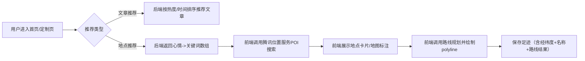

# 推荐系统文档

本文档描述“随心游”小程序的推荐系统设计与实现，包含：
- 文章推荐：为用户推荐合适的社区文章
- 地点推荐：基于用户“心情指数”推荐附近地点，并支持路线规划与保存足迹

## 一、系统总体流程



## 二、文章推荐设计

### 2.1 推荐目标

- 首页“文章推荐”最多展示 5 篇
- 推荐内容必须是数据库中真实存在的文章
- 若推荐规则取不到足够文章，则按“最新文章”兜底（有多少展示多少）

### 2.2 推荐接口

- `GET /travel/post/recommand?limit=5`

### 2.3 推荐策略

- 过滤：排除当前用户自己发布的文章
- 排序：按 `like_count desc, view_count desc, created_at desc`
- 截断：取前 `limit` 条
- 兜底：若结果为空（或推荐失败），返回“最新文章”按 `created_at desc` 取前 `limit`

该策略兼顾热度与时效，且实现成本低、可解释性强，适合毕业设计场景。

## 三、地点推荐（心情指数）设计

### 3.1 推荐目标

- 用户选择心情后，快速得到“可去的附近地点”
- 推荐具有可解释性：展示推荐原因（关键词/距离/地址）
- 支持三种路线模式：驾车/公交/步行
- 可一键保存路线为“足迹”，用于个人足迹与收藏展示

### 3.2 后端：心情 → 关键词映射

后端接口仅负责“心情→关键词数组”的映射，并返回推荐地域 region（可配置/可前端覆盖）。

- `GET /travel/recommend?mood=治愈感&region=全国`

返回：
```json
{
  "code": 200,
  "data": {
    "mood": "治愈感",
    "keywords": ["公园","海边","图书馆","绿地","湖边","安静"],
    "region": "汕头"
  },
  "msg": "获取推荐关键词成功"
}
```

### 3.3 前端：关键词 → POI 搜索与展示

前端在定制页使用腾讯位置服务 SDK（qqmap-wx-jssdk）：
- `search(keyword=关键词, location=当前定位, region=全国, distance=...)`
- 结果用于：
  - 地图 marker 标注
  - 推荐列表展示（名称/地址/推荐原因）

推荐原因示例（前端生成）：
- `附近景点 · 2.3km · 广州市天河区...`

### 3.4 路线规划与可视化

路线规划使用腾讯位置服务 `direction`：
- `mode=driving / transit / walking`
- 返回 `polyline` 后解码为坐标点数组，绘制在 map 组件的 `polyline` 上
- 同时计算并展示 “预计时间/距离”

显示格式：
- `walking · 2小时03分钟 · 8.1km`

## 四、配额与降级策略（重要）

腾讯位置服务 WebService API 对 key 存在调用限额，常见错误：
- `status=121`：此 key 每日调用量已达到上限

为降低不必要消耗，前端策略：
- 地点搜索仅在用户点击“搜索”时请求（不做输入联想的持续请求）
- 推荐列表/景点推荐按需触发（点击入口才触发）
- 当接口返回 121 时，在前端提示并引导更换 key/次日再试

## 五、可扩展方向

- 文章推荐：引入用户行为（浏览/收藏/点赞）做协同过滤或内容相似度推荐
- 地点推荐：结合用户历史足迹、收藏足迹、时间段（白天/夜晚）做权重调整
- 服务端缓存：对热门关键词 + 常见位置做短时缓存，降低外部 API 调用
