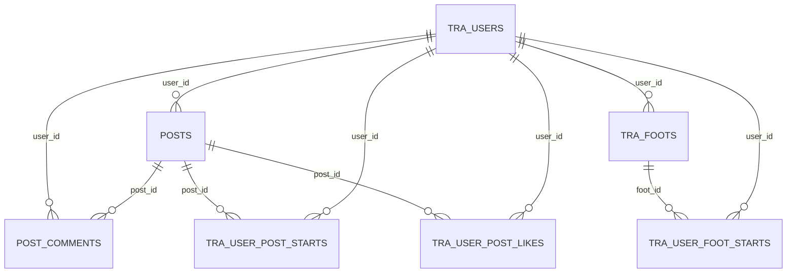
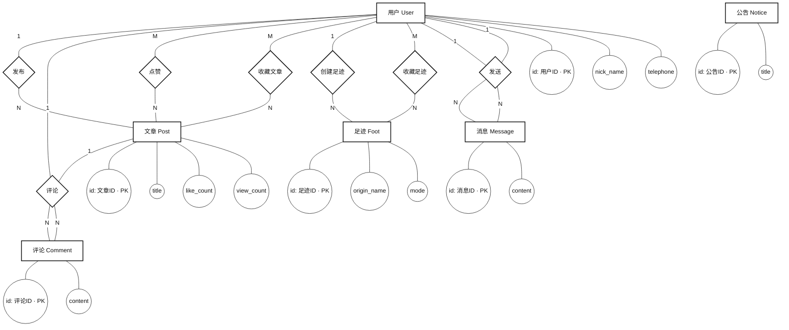

# 数据库设计文档

本文档描述“随心游”后端 MySQL 数据库表结构、关键字段、索引与表间关系（ER 图）。

## 1. 设计说明

- 数据库：MySQL
- ORM：GORM（Go）
- 主键策略：
  - 业务实体（文章/评论/公告/足迹/聊天消息）使用 UUID（存储为 `char(36)`）
  - 关系表与用户表使用自增/数值主键（`uint64`）
- 时间字段：`CreatedAt/UpdatedAt`（项目内自定义时间类型 `CustomTime`）

## 2. 表清单

- `tra_users`：用户
- `posts`：文章
- `post_comments`：文章评论
- `notices`：公告
- `chat_messages`：私聊消息
- `tra_user_post_starts`：文章收藏（用户-文章）
- `tra_user_post_likes`：文章点赞（用户-文章）
- `tra_foots`：足迹（路线记录）
- `tra_user_foot_starts`：足迹收藏（用户-足迹）
- `tra_user_foots`：用户足迹关联（预留/兼容）

说明：具体表名以 GORM 默认命名为准（结构体名转 snake_case 并复数化），如日志中可见 `tra_user_post_likes`。

## 3. 表结构

### 3.1 用户表：tra_users

| 字段 | 类型 | 约束/索引 | 说明 |
|---|---|---|---|
| id | bigint unsigned | PK | 用户ID |
| open_id | varchar(256) | NOT NULL | 微信 OpenID |
| telephone | varchar(128) |  | 手机号 |
| nick_name | varchar(128) |  | 昵称 |
| motto | varchar(128) |  | 个性签名 |
| gender | int |  | 0未知/1女/2男 |
| city/province/country | varchar(128) |  | 地区信息 |
| avatar_url | varchar(128) |  | 头像URL |
| union_id | varchar(128) |  | UnionID |
| session_key | varchar(128) |  | 微信 session_key |
| created_at/updated_at | datetime |  | 创建/更新时间 |

### 3.2 文章表：posts

| 字段 | 类型 | 约束/索引 | 说明 |
|---|---|---|---|
| id | char(36) | PK | 文章ID（UUID） |
| user_id | bigint unsigned | NOT NULL | 作者用户ID |
| title | varchar(30) | NOT NULL | 标题 |
| head_img | text |  | 头图 |
| content | text | NOT NULL | 正文 |
| view_count | bigint | DEFAULT 0 | 浏览量 |
| like_count | bigint | DEFAULT 0 | 点赞数 |
| created_at/updated_at | datetime |  | 创建/更新时间 |

### 3.3 评论表：post_comments

| 字段 | 类型 | 约束/索引 | 说明 |
|---|---|---|---|
| id | char(36) | PK | 评论ID（UUID） |
| post_id | char(36) | INDEX | 所属文章ID |
| user_id | bigint unsigned | INDEX | 评论用户ID |
| content | text | NOT NULL | 评论内容 |
| created_at/updated_at | datetime |  | 创建/更新时间 |

### 3.4 公告表：notices

| 字段 | 类型 | 约束/索引 | 说明 |
|---|---|---|---|
| id | char(36) | PK | 公告ID（UUID） |
| title | varchar(128) | NOT NULL | 标题 |
| content | text | NOT NULL | 内容 |
| image_url | text |  | 图片URL |
| link_url | varchar(256) |  | 跳转链接 |
| created_at/updated_at | datetime |  | 创建/更新时间 |

### 3.5 私聊消息表：chat_messages

| 字段 | 类型 | 约束/索引 | 说明 |
|---|---|---|---|
| id | char(36) | PK | 消息ID（UUID） |
| from_user_id | bigint unsigned | INDEX | 发送者 |
| to_user_id | bigint unsigned | INDEX | 接收者 |
| content | text | NOT NULL | 消息内容 |
| created_at/updated_at | datetime |  | 创建/更新时间 |

### 3.6 文章收藏：tra_user_post_starts

| 字段 | 类型 | 约束/索引 | 说明 |
|---|---|---|---|
| id | bigint unsigned | PK | 记录ID |
| user_id | bigint unsigned | NOT NULL | 用户ID |
| post_id | char(36) | NOT NULL | 文章ID |

### 3.7 文章点赞：tra_user_post_likes

| 字段 | 类型 | 约束/索引 | 说明 |
|---|---|---|---|
| id | bigint unsigned | PK | 记录ID |
| user_id | bigint unsigned | uniqueIndex(idx_user_post_like) | 用户ID |
| post_id | char(36) | uniqueIndex(idx_user_post_like) | 文章ID |

说明：联合唯一索引 `idx_user_post_like(user_id, post_id)` 用于防止重复点赞。

### 3.8 足迹表：tra_foots

| 字段 | 类型 | 约束/索引 | 说明 |
|---|---|---|---|
| id | char(36) | PK | 足迹ID（UUID） |
| user_id | bigint unsigned | INDEX | 创建者用户ID |
| title | varchar(128) |  | 足迹标题 |
| origin | varchar(64) | NOT NULL | 起点经纬度（lat,lng） |
| origin_name | varchar(128) |  | 起点名称（展示用） |
| destinations | text | NOT NULL | 终点经纬度数组（JSON字符串） |
| destination_names | text |  | 终点名称数组（JSON字符串） |
| mode | varchar(32) | NOT NULL | 路线模式（driving/transit/walking） |
| route_result | longtext | NOT NULL | 路线规划原始结果（JSON字符串） |
| created_at/updated_at | datetime |  | 创建/更新时间 |

### 3.9 足迹收藏：tra_user_foot_starts

| 字段 | 类型 | 约束/索引 | 说明 |
|---|---|---|---|
| id | bigint unsigned | PK | 记录ID |
| user_id | bigint unsigned | NOT NULL | 用户ID |
| foot_id | char(36) | NOT NULL | 足迹ID |

### 3.10 用户足迹关联：tra_user_foots

| 字段 | 类型 | 约束/索引 | 说明 |
|---|---|---|---|
| id | bigint unsigned | PK | 记录ID |
| user_id | bigint unsigned | NOT NULL | 用户ID |
| foot_id | char(36) | NOT NULL | 足迹ID |

## 4. ER 图（Mermaid）

说明：
- 收藏/点赞表为用户与文章/足迹的多对多关系（通过关系表实现）
- 私聊消息与用户为两条外键关系（from/to）

## 5. 概念模型 ER 图（陈氏记法：矩形/菱形/椭圆）

学校常说的“有棱形/正方形/椭圆”的 ER 图，通常指 **陈氏 ER 图（Chen Notation）**：
- 矩形：实体（表）
- 菱形：联系（关系）
- 椭圆：属性（字段）
- 主键：在属性上标注 PK（或在画图工具里对主键属性下划线）
- 多值属性：双椭圆（本项目中如 destinations/destination_names，实际用 JSON 文本存储）

下图为本项目概念模型的“陈氏风格示意”（用于答辩截图/论文插图）。你也可以按此结构用 Visio/ProcessOn/PowerDesigner 重新绘制标准椭圆版本。

